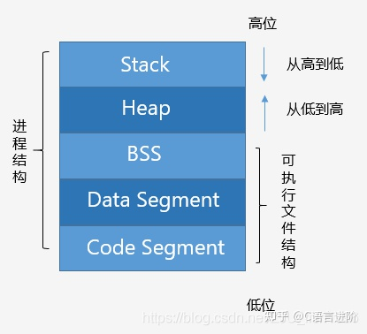
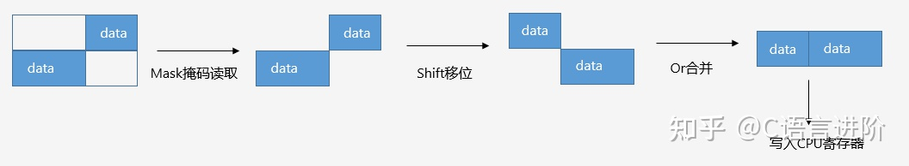
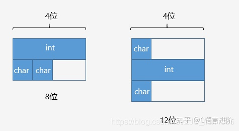
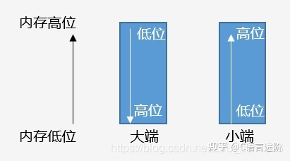

# 1 面向对象

面向对象的三大特征：封装、继承和多态。

## 1.1 继承

**让某种类型对象获得另一个类型对象的属性和方法。**

它可以使用现有类的所有功能，并在无需重新编写原来的类的情况下对这些功能进行扩展，常见的继承有三种方式：

（1）实现继承：指使用基类的属性和方法而无需额外编码的能力；

（2）接口继承：指仅使用父类方法的名称，子类必须提供自己提供实现；

（3）可视继承：指子窗体（类）使用基窗体（类）的外观和实现代码的能力（C++里好像不怎么用）。

## 1.2 封装

数据和代码捆绑在一起，避免外界干扰和不确定性访问。

封装，也就是**把客观事物的属性和行为抽象包装成类**，并且类可以把自己的数据和方法只让可信的类或者对象操作，对不可信的进行信息隐藏，例如：将公共的数据或方法使用public修饰，而不希望被访问的数据或方法采用private修饰。

## 1.3 多态

多态就是**同一个接口（方法）在面对不同的对象时表现出不同的形态**，即向不同对象发送同一消息，不同的对象在接收时会产生不同的行为。分为**编译时的多态和运行时的多态**。编译时的多态就是函数重载，包括运算符重载，编译时根据**实参**确定调用哪个函数。运行时多态发生在继承中，是通过虚函数及虚函数表实现的。

## 1.4 多态的实现方法

为了实现 C++ 的多态，C++ 使用了一种动态绑定的技术。这个技术的核心是[虚函数表](https://blog.csdn.net/lihao21/article/details/50688337?ops_request_misc=%7B%22request%5Fid%22%3A%22161707164216780261927932%22%2C%22scm%22%3A%2220140713.130102334.pc%5Fall.%22%7D&request_id=161707164216780261927932&biz_id=0&utm_medium=distribute.pc_search_result.none-task-blog-2~all~first_rank_v2~rank_v29-8-50688337.first_rank_v2_pc_rank_v29&utm_term=c%2B%2B%E3%80%80%E8%99%9A%E5%87%BD%E6%95%B0)（简称虚表）。

虚表是一个指针数组，其元素是虚函数的指针，每个元素对应一个虚函数。

虚表内的条目，即虚函数指针的赋值发生在编译器的编译阶段，也就是说在代码的**编译**阶段，虚表就可以构造出来了。

虚表是属于类的，而不是属于某个具体的对象，一个类只需要一个虚表即可。同一个类的所有对象都使用同一个虚表。为了让每个包含虚表的类的对象都能访问虚表，编译器在类中添加了一个成员指针，`*__vfptr`，用来指向虚表，这样，当类的对象在创建时便拥有了这个指针，且这个指针的值会自动被设置为指向类的虚表。 

派生类会继承基类的虚表，在重写虚函数的时候，会将继承过来的虚函数表中的函数地址替换成派生类的地址，这样当我们声明了一个基类的指针或者引用来指向字类对象的时候，我们就能通过该指针或者引用访问到子类对象的虚表指针，通过虚表指针调用子类的虚函数。这样就实现了动态绑定。

```c++
	(*(p->__vfptr)[n])(p)
```

那么，什么时候会执行函数的动态绑定？这需要符合以下三个条件（**通过父类的指针或引用访问字类的虚函数**）：

- 通过指针或者引用来调用函数
- 指针 upcast 向上转型
- 调用的是虚函数

简单点来说就是通过父类的指针或引用来访问子类的虚函数。

# 2 虚函数

用关键字`virtual`声明的类成员函数称为虚函数，用于指明该函数会被子类继承。

## 2.1 构造函数或析构函数中是否可以调用虚函数？

可以。不过调用会屏蔽多态机制，最终会把基类中的该虚函数作为普通函数调用，而不会调用派生类中的被重写的函数。

这是因为在创建子类对象的时候，会先调用父类的构造函数，而此时虚函数表以及**子类对象还没有被初始化**，如果此时发生发生多态行为，**有可能会调用未被初始化的内存**，C++标准规范中规定了在这种情况下，即在构造子类时调用父类的构造函数，而父类的构造函数中又调用了虚成员函数，这个虚成员函数即使被子类重写，也不允许发生多态的行为。所以使用的是静态绑定，调用了父类的函数。

```c++
#include <iostream>

class Base
{
public:
    Base() {
        Function();
    }
    virtual void Function() {
        std::cout << "Base::Function" << std::endl;
    }
    ~Base() {
        Function();
    }
};

class A : public Base
{
public:
    A() {
        Function();
    }
    void Function() override {
        std::cout << "A::Function" << std::endl;
    }
    ~A() {
        Function();
    }
};

int main() {
    Base* a = new Base;
    delete a;
    std::cout << "----------------------" << std::endl;
    Base* b = new A;
    delete b;
}

// 输出结果
// Base::Function
// Base::Function
// --------------------------
// Base::Function              // 先调用父类的构造函数
// A::Function		           // 再调用自己的构造函数
// Base::Function			   // 只调用了父类的析构函数
```


## 2.2 构造函数可以是虚函数吗？

 不可以，因为虚函数存在的唯一目的就是为了多态。 

**但是派生类并不继承构造函数，构造函数是在创建对象时自己主动调用的，不可能通过父类的指针或者引用去调用继承，在这个过程中不会发生多态行为，**所以没必要（主要原因）。

另一方面，**构造函数为类对象初始化了内存空间，里面保存指向虚函数的指针__vfptr，如果构造函数是虚函数，导致没有实例化类对象，也就没有内存空间，也就不可能通过虚表指针调用虚函数**。

## 2.3 析构函数可以是虚函数吗？

析构函数必须是虚函数。因为如果不是虚函数，**当在主函数中用父类的指针或引用指向一个子类对象时，最后析构的时候，只会调用父类析构函数而不会调用子类析构函数。而且如果不为虚函数，父类指针无法调用子类的非虚成员函数。**

父类析构函数成为虚函数时，子类的析构函数会自动也变为虚函数。这个时候编译器会忽略指针的类型，而根据指针的指向来选择函数；也就是说，指针指向哪个类的对象就调用哪个类的函数。pb、pd 都指向了派生类的对象，所以会调用派生类的析构函数，继而再调用基类的析构函数。

## 2.4 静态函数可以是虚函数吗？

不可以。会出现编译错误。虚函数是通过**对象内存空间中的虚表指针实现调用**的，而**静态函数不属于任何对象**，如果静态函数是虚函数的话就没办法调用了。

（1）static成员**不属于任何类对象或类实例**，所以即使给此函数加上virtual也是没有任何意义的。

（2） 静态与非静态成员函数之间有一个主要的区别。那就是静态成员函数**没有this指针**。所以无法访问__vfptr，进而不能访问虚函数表。 

## 2.5 虚函数的有安全问题吗？

可以通过虚函数表，让父类指针访问子类的自有虚函数。这带来一定的安全问题。另外，即使父类的虚函数是私有函数或者保护函数，仍然可以通过虚函数表访问，带来一定的安全问题。 

# 3 [智能指针](https://zhuanlan.zhihu.com/p/365414133)

## 3.1 shared_ptr

shared_ptr采用**共享式拥有**概念。多个智能指针可以指向相同的对象，该对象及其相关资源会在最后一个引用被销毁时释放。

shared_ptr 指向的资源会被多个指针共享，它使用**计数机制**来记录资源被多少指针共享，通过成员函 use_count()来查看资源所有者的数量。通过调用 reset()函数，当前指针会释放资源的所有权，资源所有者数量减一。除了可以通过 new 来构造，还可以通过传入unique_ptr，weak_ptr来构造。

```c++
#include <memory>

std::shared_ptr<string> p1(new string("hello world"));
std::shared_ptr<string> p2;
p2 = p1;

cout << *p1 << endl;
cout << *p2 << endl;
```

原理：引用计数，每多一个智能指针指向同一个内存，就把计数加1，当计数减到0的时候就释放该指针。当该指针作为形参传递的时候，计数会加1，当它出该函数时会自动减一。

```c++
#include <iostream>
#include <memory>
#include <string>

using namespace std;

void fun() {
    shared_ptr<string> pa(new string("CHN"));
    shared_ptr<string> pb(new string("USA"));
    cout << "*pa " << *pa << endl;//CHN
    cout << "pa.use_count " << pa.use_count() << endl;//1
    cout << "*pb " << *pb << endl;//USA
    cout << "pb.use_count " << pb.use_count() << endl;//1

    pa = pb;
    cout << *pa << endl;//USA
    cout << "pa.use_count " << pa.use_count() << endl;//2：pa和pb指向同一个资源USA了，该资源的计数为2，所以pb、pb都输出2
    cout << "pb.use_count " << pb.use_count() << endl;//2

    pa.reset();
    pb.reset();
    cout << "pa.use_count " << pa.use_count() << endl;//0
    cout << "pb.use_count " << pb.use_count() << endl;//0
}

int main()
{
    fun();
    system("pause");
    return 0;
}

// result
/*
*pa CHN
pa.use_count 1
*pb USA
pb.use_count 1
USA
pa.use_count 2
pb.use_count 2
pa.use_count 0
pb.use_count 0
*/
```

在使用`shared_ptr`时不能通过单独托管的方式使两个智能指针托管同一个指针：

```c++
C *ptr = new C;
std::shared_ptr<C> pa(ptr);
std::shared_ptr<C> pb(ptr);		// 报错
```

`pa`和`pb`并不会共享同一个对`ptr`的托管计数，而是各自将对`ptr`的托管计数都记为 1（`pb`无法知道`ptr`已经被`pa`托管过）。这样，当`pa`消亡时要析构`ptr`，`pb`消亡时要再次析构`ptr`，这会导致程序崩溃。

## 3.2 weak_ptr

weak_ptr 是一种**不控制对象生命周期**的智能指针，它指向一个 shared_ptr 管理的对象，但是不影响shared_ptr的引用计数。

weak_ptr 设计的目的是用于解决shared_ptr**相互引用时产生死锁**问题。如果有两个shared_ptr相互引用，那么这两个shared_ptr指针的引用计数永远不会下降为0，资源永远不会释放。weak_ptr是对对象的一种**弱引用**，它不会增加对象的use_count，weak_ptr和shared_ptr可以相互转化，shared_ptr可以直接赋值给weak_ptr，weak_ptr也可以通过调用lock函数来获得shared_ptr。

```c++
#include <iostream>
#include <memory>
#include <string>
    
using namespace std;

class B;
class A
{
public:
    shared_ptr<B> pb_;
    ~A()
    {
        cout << "A delete\n";
    }
};
class B
{
public:
    shared_ptr<A> pa_;
    ~B()
    {
        cout << "B delete\n";
    }
};

void fun() {
    shared_ptr<B> pb(new B());
    cout << "pb.use_count " << pb.use_count() << endl;//1
    shared_ptr<A> pa(new A());
    cout << "pa.use_count " << pa.use_count() << endl;//1

    pb->pa_ = pa;
    cout << "pb.use_count " << pb.use_count() << endl;//1
    cout << "pa.use_count " << pa.use_count() << endl;//2
    pa->pb_ = pb;
    //由于share_ptr是共享资源，所以pb所指向的资源的引用计数也会加1
    cout << "pb.use_count " << pb.use_count() << endl;//2
    cout << "pa.use_count " << pa.use_count() << endl;//2
    //程序结束时，没有调用A和B的析构函数
}

int main()
{
    fun();
    system("pause");
    return 0;
}

// result
// pb.use_count 1
// pa.use_count 1
// pb.use_count 1
// pa.use_count 2
// pb.use_count 2
// pa.use_count 2
```

使用weak_ptr消除循环引用带来的内存泄露问题：

```c++
#include <iostream>
#include <memory>
#include <string>

using namespace std;

class B;
class A
{
public:
    weak_ptr<B> pb_weak;
    ~A()
    {
        cout << "A delete\n";
    }
};
class B
{
public:
    shared_ptr<A> pa_;
    ~B()
    {
        cout << "B delete\n";
    }
    void print() {
        cout << "This is B" << endl;
    }
};

void fun() {
    shared_ptr<B> pb(new B());
    cout << "pb.use_count " << pb.use_count() << endl;//1
    shared_ptr<A> pa(new A());
    cout << "pa.use_count " << pa.use_count() << endl;//1

    pb->pa_ = pa;
    cout << "pb.use_count " << pb.use_count() << endl;//1
    cout << "pa.use_count " << pa.use_count() << endl;//2

    pa->pb_weak = pb;
    cout << "pb.use_count " << pb.use_count() << endl;//1：弱引用不会增加所指资源的引用计数use_count()的值
    cout << "pa.use_count " << pa.use_count() << endl;//2

    shared_ptr<B> p = pa->pb_weak.lock();
    p->print();//不能通过weak_ptr直接访问对象的方法，须先转化为shared_ptr
    cout << "pb.use_count " << pb.use_count() << endl;//2
    cout << "pa.use_count " << pa.use_count() << endl;//2
}//函数结束时,调用A和B的析构函数

//资源B的引用计数一直就只有1，当pb析构时，B的计数减一，变为0，B得到释放，
//B释放的同时也会使A的计数减一，同时pa自己析构时也会使资源A的计数减一，那么A的计数为0，A得到释放。


int main()
{
    fun();
    system("pause");
    return 0;
}
// result
/*
pb.use_count 1
pa.use_count 1
pb.use_count 1
pa.use_count 2
pb.use_count 1
pa.use_count 2
This is B
pb.use_count 2
pa.use_count 2
B delete
A delete
*/
```

## 3.3 unique_ptr

unique_ptr 采用**独占式拥有或严格拥有**的概念，确保同一时间内只有一个指针指向给定内存。

unique_ptr对象包装一个原始指针，并负责其生命周期。当该对象被销毁时，会在其析构函数中删除关联的原始指针。

unique_ptr 不共享它管理的对象，也无法复制到其他的unique_ptr ，只能移动 unique_ptr ，即对资源管理权限可以实现转移。这意味着，内存资源所有权可以转移到另一个 unique_ptr ，并且原始的 unique_ptr 不再拥有该资源。

```c++
#include <memory>

std::unique_ptr<std::string> p1 = new std::string("hello world");
std::unique_ptr<std::string> p2;
p2 = p1;											// 不合法
```

虽然编译器不允许对unique_ptr对象之间直接进行赋值，但是可以转移资源得管理权限，通过std::move()来实现。

```c++
std::unique_ptr<std::string> p1(new std::string("I am a string"));
std::unique_ptr<std::string> p2;
p2 = std::move(p1);										// 合法
```

## 

# 4 [类型转换](http://c.biancheng.net/view/2343.html)

```c++
newType new_data = xxxx_cast<oldType>(old_data);
```


## 4. 1 static_cast

用于各种隐式转换。比如非const转const，void*转指针等。还能用于多态向上转换，如果向下转能成功但是不安全，且结果未知。

（1）近似类型转换，如int转double,short转int,const转非const,向上转型等。

```c++
int m=10;  
long n= static_cast<long>(m);
```

（2）void*指针和具体类型指针之间的转换，例如 void *转 int *、char *转 void *等。

```c++
int *p1 = static_cast<int*>( malloc(10 * sizeof(int)) ); //malloc申请的是void*指针
```

（3）有转换构造函数或者类型转换函数的类与其它类型之间的转换，例如 double 转 Complex（调用转换构造函数）、Complex 转 double（调用类型转换函数）。

## 4.2 reinterpret_cast

可以认为是 static_cast 的一种补充，一些 static_cast 不能完成的转换，就可以用 reinterpret_cast 来完成，例如**两个具体类型指针之间的转换**、**int 和指针之间的转换。非常简单粗暴，但是风险很高。**

对于两个具体类型指针之间的转换，不同类型的数据存储格式不一样，长度也不一样，用 A 类型的指针指向 B 类型的数据后，会按照 A 类型的方式来处理数据：如果是读取操作，可能会得到一堆没有意义的值；如果是写入操作，可能会使 B 类型的数据遭到破坏，当再次以 B 类型的方式读取数据时会得到一堆没有意义的值；

对于int 和指针之间的转换，将一个具体的地址赋值给指针变量是非常危险的，因为该地址上的内存可能没有分配，也可能没有读写权限，恰好是可用内存反而是小概率事件。

## 4.3 const_cast

用来将const/volatile 类型转换为非 const/volatile 类型。 

```c++
const int n = 100; 
int* p = const_cast<int*>(&n);
```

## 4.4 dynamic_cast

用于在类的继承层次之间进行类型转换，它既允许向上转型（Upcasting），就是把派生类指针转换为基类指针；也允许向下转型（Downcasting）。向上转型是无条件的，不会进行任何检测，所以都能成功；向下转型的前提必须是安全的，要借助 RTTI 进行检测，所有只有一部分能成功。


# 5 引用和指针

## 5.1 引用

一个已经存在的对象的别名，引用并非对象。

## 5.2 指针

用来存放地址的一种类型，指向内存中某块存储单元，指针本身就是对象。

## 5.3 区别

（1）引用不是一个对象，所以程序不会为引用分配内存空间；而指针是一个对象，所以程序会为它分配内存区域；

（2）引用不能为空，所以在定义时必须初始化，且之后无法改变；指针可以为空，且在生命周期中可以指向不同的对象；

```c++
int n = 10;
int& ref = n;
// const int &r = 10;			// 常量引用
int* p = &n;
```

（3）引用只能一级，指针可以多级；

## 5.4 [值传递、引用传递和指针传递](https://www.cnblogs.com/dingxiaoqiang/p/8012578.html)

**（1）值传递**：形参是实参的拷贝，改变形参的值并不会影响外部实参的值。从被调用函数的角度来说，值传递是单向的（实参->形参），参数的值只能传入，不能传出。当函数内部需要修改参数，并且不希望这个改变影响调用者时，采用值传递。

**（2）引用传递**：形参相当于是实参的“别名”，对形参的操作其实就是对实参的操作，在引用传递过程中，被调函数的形式参数虽然也作为局部变量在栈中开辟了内存空间，但是这时存放的是由主调函数放进来的实参变量的地址。被调函数对形参的任何操作都被处理成间接寻址，即通过栈中存放的地址访问主调函数中的实参变量。正因为如此，被调函数对形参做的任何操作都影响了主调函数中的实参变量。

**（3）指针传递**： 形参为指向实参地址的指针，当对形参的指向操作时，就相当于对实参本身进行的操作 。

# 6 [拷贝](http://c.biancheng.net/view/2336.html)

## 6.1 浅拷贝

浅拷贝是**指对象和被拷贝对象共用一份实体（指向同一块内存空间）**，仅仅是引用的变量不同（名称不同）。对其中任何一个对象的改动都会影响另外一个对象。 **不需要开辟新的空间。**

```c++
class String
{
public:
	String(const char* str) : _str_(new char[strlen(str) + 1])
	{
		strcpy(_str_, str);
	}
    
    String(const String& s) : _str_(s._str_)
    {
        
    }
	
	String& operator=(const String& s)
	{
		if (this != &s)
		{
			_str_ = s._str_;
		}
		return *this;
	}
	
	~String()
	{
		if (_str_)
		{
			delete[] _str_;
		}
		_str_ = NULL;
	}
private:
	char* _str_;
};
```

存在的问题：

（1）当多个指针指向同一个空间时，一旦一个指针修改了这块空间的值，则其它的指针指向的值也会改变。

（2）多个指针指向同一块空间，这个内存可能就会被释放多次。例如定义了一个String对象s1，以浅拷贝的方式拷贝构造了一个String对象s2，则s1和s2里面的指针_str就会指向同一块空间；当出了作用域，s2先调用析构函数，而上面代码中析构函数里面进行了空间的释放，也就是这个空间就会被s2释放，接下来会调用s1的析构函数，也会去释放这块空间，释放一块已经不属于我的空间就会出错。

## 6.2 深拷贝

深拷贝是指源对象与被拷贝对象互相独立 。在拷贝对象时，如果被拷贝对象内部还有指针引用指向其它资源，就需要**开辟一块新的空间**接收资源，其中任何一个对象的改动都不会对另外一个对象造成影响。

```c++
/*
    对于拷贝构造函数来说，s2先开辟一块和s1一样大的空间；而对于赋值运算重载函数来说由于s2已经存在，所以必须先释放s2的空间然后再开辟和s1一样大的空间。然后让s2指向这块新开辟的空间，再将s1中的数据拷贝到其中。
*/
class String
{
public:
	String(const String& s)
    {
        _str_ = new char[strlen(s._str_) + 1];
        strcpy(_str_, s._str_);
    }
    
    String& operator=(const String& s)
    {
        if (this != &s)
        {
            delete[] _str_;
            _str_ = NULL;
            _str_ = new char[strlen(s._str_) + 1];
            strcpy(_str_, s._str_);
        }
        return *this;
    }
private:
	char* _str_;
};     

/*
让别人去开空间，去拷数据，而我将你的空间与我交换就可以。
例如用s1拷贝构造一个s2对象s2(s1)，可以通过构造函数将s1里的指针str构造一个临时对象tmp（构造函数不仅会开空间还会将数据拷贝至tmp）,此时tmp就是我们想要的哪个对象，然后将新tmp的指针ptr与自己的指针进行交换。
对于构造函数来说，因为String有一个带参数的构造函数，则用现代写法写拷贝构造时可以调用构造函数，而对于没有无参的构造函数的类只能采用传统写法（开空间然后拷数据）。
*/
class String
{
public:
    // 拷贝构造
	 String(const String& s) : _str_(NULL)
     {
         // 调用构造函数，创建一个临时的tmp对象
         String tmp(s._str_);
         std::swap(_str_, tmp._str_);
     }
    // 赋值
    String& operator=(const String& s)
    {
        if (this != &s)
        {
            String tmp(s._str_);
            std::swap(_str_, smp._str_);
        }
        return *this;
    }
private:
    char* _str_;
};
```


# 7 [左值和右值](https://mp.weixin.qq.com/s/aCv7vIyrGyqu06QpNjZFTA)

C++11提出的概念，所有的值都属于左值或者右值。

**可以取地址的，有名字的，非临时的就是左值；**即左值是可以放在表达式左边的。

**不能取地址的，没有名字的，临时的就是右值。**只能放在表达式右边。

## 7.1 左值引用

对左值的引用。

```c++
int v = 10;			// v是一个左值
int &r = v;			// 一个指向v的引用
printf("r = %d, v = %d", r, v);			// r = 10, v = 10
r = 20;				// 通过应用来改变原值
printf("r = %d, v = %d", r, v);			// r = 20, v = 20

int &r_error = 10;				// 错误，10是右值，无法直接被引用，需要使用常引用
const int &r_const = 10;		// 正确，常引用可以引用右值
```

左值引用要求右边的值必须能够取地址，如果无法取地址，只能用**常引用**；

但使用常引用后，我们只能通过引用来读取数据，**无法去修改数据**，因为其被const修饰成常量引用了。

## 7.2 右值引用

必须绑定到**右值**的引用。通过`&&（通用引用类型）`来获取右值引用，只能绑定到一个**将要销毁的对象**，用来支持**移动语义？**。

右值引用用来绑定到右值，绑定到右值以后本来会被销毁的右值的**生命期会延长至与绑定到它的右值引用的生命期一致。**

```
int &&r = 10;			// 正确 
```

右值引用可以进行**读写操作**，而常引用只能进行读操作。

右值引用的存在并不是为了取代左值引用，而是充分利用右值(特别是临时对象)的构造来**减少对象构造和析构操作**以达到提高效率的目的。

带右值引用参数的拷贝构造和赋值重载函数，又叫**移动构造函数和移动赋值函数**，这里的移动指的是把临时量的资源移动给了当前对象，临时对象就不持有资源，为nullptr了，实际上没有进行任何的数据移动，**没发生任何的内存开辟和数据拷贝。**

## 7.3 [移动语义](http://avdancedu.com/a39d51f9/)

移动语义，可以理解为**转移资源所有权**，之前的拷贝是对于别人的资源，自己重新分配一块内存存储复制过来的资源，而对于移动语义，类似于转让或者资源窃取的意思，对于那块资源，转为自己所拥有，别人不再拥有也不会再使用。通过C++11新增的移动语义可以省去很多拷贝负担，提高程序性能。怎么利用移动语义呢，是通过移动构造函数。

std::move()可以将一个左值变成右值

```c++
#include <iostream>

// Move Semantics
class Base {
public:
    explicit Base(int size) : size_(size) {
        this->data_ = new int [size];
    }
    Base() = default;
    // Copy Constructor
    Base(const Base& base) {
        this->size_ = base.size_;
        this->data_ = new int [size_];
        std::cout << "Copy Constructor!" << std::endl;
    }
    // move constructor
    Base(Base &&base) noexcept : size_(base.size_), data_(base.data_) {
        base.data_ = nullptr;
        std::cout << "Move Constructor!" << std::endl;
    }

    //move assignment
    Base &operator=(Base &&base) noexcept {
        this->data_ = base.data_;
        this->size_ = base.size_;
        base.data_ = nullptr;
        std::cout << "Move Assignment!" << std::endl;
        return *this;
    }

public:
    int *data_;
    int size_;
};

int main() {
    Base base(10);

    Base base1(base);
    Base base2;
    base2 = base;

    Base base_move1(std::move(base));
    Base base_move2;
    base_move2 = std::move(base);
    return 0;
}

// result
/*
    Copy Constructor!
    Assignment Consturctor!
    Move Constructor!
    Move Assignment!
*/
```

## 7.4 [完美转发](https://zhuanlan.zhihu.com/p/161039484)

std::forward被称为**完美转发**，它的作用是**保持原来的值属性不变**。通俗的讲就是，如果原来的值是左值，经std::forward处理后该值还是左值；如果原来的值是右值，经std::forward处理后它还是右值。

```c++
#include <iostream>

template<typename T>
void print(T & t){
    std::cout << "左值" << std::endl;
}

template<typename T>
void print(T && t){
    std::cout << "右值" << std::endl;
}

template<typename T>
// && 通用引用类型
void testForward(T && v){
    print(v);
    print(std::forward<T>(v));
    print(std::move(v));
}

int main(int argc, char * argv[])
{
    testForward(1);

    std::cout << "======================" << std::endl;

    int x = 1;
    testFoward(x);
}

// result
/*
    左值（1传参后变成左值）
    右值（完美转发，1还是当右值传进去）
    右值（移动语义，右值）
    =========================
    左值（x传参后变成左值）
    左值（完美转发，x本身就是左值）
    右值（移动语义，变成右值）
*/
```

# 8 关键字

## 8.1 [this](https://zhuanlan.zhihu.com/p/94864064)

this指针是一个隐含于每一个非静态成员函数中的**特殊指针**。它指向**调用该成员函数的那个对象**，当一个对象调用成员函数时，编译程序先将对象的地址赋值给this指针，然后调用成员函数，每次成员函数存取数据成员时，都隐式使用this指针。

（1）this是const指针，它的值是不能被修改的，一切试图修改该指针的操作都是违法的；

（2）this指针只能在成员函数内部使用；

（3）只有当对象创建后this才有意义，因此不能在静态成员函数中使用（静态成员函数不属于对象）。

每个成员函数都**默认有一个参数是指向对象的this指针**：

```c++
class A
{
    int i;
    public:
    void Hello() { cout << "hello" << endl; }
    // void Hello(A * this ) { cout << "hello" << endl; }
};

class B
{
    int i;
public:
    void Hello() { cout << i << "hello" << endl; }
    // ->> void Hello(A * this ) { cout << this->i << "hello" << endl; }
};

int main()
{
    A * pa = NULL;
    pa->Hello();	// 正常输出“hello”
    
    B *pb = NULL;
    pb->Hello();	// 错误，因为Hello中通过指针调用了成员变量，空指针不能访问成员变量
}
```


## 8.2 static


## 8.3 const

用来声明一个变量是**常量**，任何修改该常量的行为都是非法的。

（1）**顶层const**

const修饰的是指针，则指针的指向不可变，但是可以通过指针改变指向内容的值。

```c++
int a = 1, b = 2;
int *const p = &a;
*p = 2;					// 可以
p = &b;					// 不可以
```

（2）**底层const**

const修饰的是指向的内容，则指针的指向可变，但是不可以通过指针改变内容的值。

```c++
int a = 1, b = 2;
const int *p = &a;
*p = 2;					// 不可以
p = &b;					// 可以
```

### 8.3.1 const和constexpr的区别

const保证了运行时不可以被修改，但是它修饰的内容任然可能是个动态变量；

将变量声明为constexpr类型以便由编译器来验证变量的值是否是一个常量表达式。用constxepr声明的变量必须是一个**常量**，而且必须用**常量表达式进行初始化**。

constexpr可以用于修饰函数，这个函数的返回值会尽可能在编译期间被计算出来当作一个常量，但是如果编译期间此函数不能被计算出来，那它就会当作一个普通函数被处理

```c++
constexpr int fun(int i) {
    return i + 1;
}
int main() {
    int i = 2;
    fun(i);		// 普通函数
    fun(2);		// 编译期间就会被计算出来
}
```


## 8.4 decltype

选择并返回操作数的数据类型，编译器分析表达式并得到它的类型，却不实际计算表达式的值。

希望从表达式的类型推断出要定义的变量的类型，但是不想用该表达式的值初始化变量。

```c++
const int ci = 0, &cj = ci;
decltype(ci) x = 0;					// int x = 0;
decltype(cj) y = x;					// int &y = x;

decltype((ci)) z = x;				// 双层括号表示引用类型，必须要初始化
```

## 8.5 extern

extern可以置于变量或者函数前，以**标示变量或者函数的定义在别的文件中，提示编译器遇到此变量和函数时在其他模块中寻找其定义**。此外extern也可用来进行链接指定。

（1）修饰变量或者函数名。表明变量或者函数已经在其它地方声明过了，提醒编译器去其它地方寻找。

```c++
#include <iostream>

int Func();

int main()
{
    Func();
    // num的定义是在mian()函数后面的，如果不声明extern，输出就不是我们想要的1了
    extern int num;
    std::cout << num << std::endl;
}

int g_num = 1;
void Func()
{
    int g_num = 2;
    std::cout << g_num << std::endl;
}
```

（2）extern "C"

告诉编译器在编译fun这个函数名时按着C的规则去翻译相应的函数名而不是C++的，C++的规则在翻译这个函数名时会把fun这个名字变得面目全非，可能是fun@aBc_int_int#%$也可能是别的，这要看编译器的"脾气"了(不同的编译器采用的方法不一样)，为什么这么做呢，因为C++支持函数的重载啊。

```c++
#ifdef __cplusplus
extern "C" {
#endif

void *memset(void *, int, size_t);

#ifdef __cplusplus
}
#endif
```

## 8.6 volatile

volatile 关键字是一种类型修饰符，变量可以被某些编译器未知的因素（操作系统、硬件、其它线程等）更改，使用 volatile 告诉编译器不应对这样的对象进行优化。

volatile 关键字声明的变量，每次访问时都必须从内存中取出值（没有被 volatile 修饰的变量，可能由于编译器的优化，从 CPU 寄存器中取值）。

const可以时volatile，指针也可以时volatile。

## 8.7 explicit

explicit修饰构造函数时，可以防止隐式转换和复制初始化。

explicit修饰转换函数时，可以防止隐式转换，但按语境转换除外。

```c++
struct A
{
	A(int) { }
	operator bool() const { return true; }
};

struct B
{
	explicit B(int) {}
	explicit operator bool() const { return true; }
};

void doA(A a) {}

void doB(B b) {}

int main()
{
	A a1(1);		// OK：直接初始化
	A a2 = 1;		// OK：复制初始化
	A a3{ 1 };		// OK：直接列表初始化
	A a4 = { 1 };		// OK：复制列表初始化
	A a5 = (A)1;		// OK：允许 static_cast 的显式转换 
	doA(1);			// OK：允许从 int 到 A 的隐式转换
	if (a1);		// OK：使用转换函数 A::operator bool() 的从 A 到 bool 的隐式转换
	bool a6(a1);		// OK：使用转换函数 A::operator bool() 的从 A 到 bool 的隐式转换
	bool a7 = a1;		// OK：使用转换函数 A::operator bool() 的从 A 到 bool 的隐式转换
	bool a8 = static_cast<bool>(a1);  // OK ：static_cast 进行直接初始化

	B b1(1);		// OK：直接初始化
	B b2 = 1;		// 错误：被 explicit 修饰构造函数的对象不可以复制初始化
	B b3{ 1 };		// OK：直接列表初始化
	B b4 = { 1 };		// 错误：被 explicit 修饰构造函数的对象不可以复制列表初始化
	B b5 = (B)1;		// OK：允许 static_cast 的显式转换
	doB(1);			// 错误：被 explicit 修饰构造函数的对象不可以从 int 到 B 的隐式转换
	if (b1);		// OK：被 explicit 修饰转换函数 B::operator bool() 的对象可以从 B 到 bool 的按语境转换
	bool b6(b1);		// OK：被 explicit 修饰转换函数 B::operator bool() 的对象可以从 B 到 bool 的按语境转换
	bool b7 = b1;		// 错误：被 explicit 修饰转换函数 B::operator bool() 的对象不可以隐式转换
	bool b8 = static_cast<bool>(b1);  // OK：static_cast 进行直接初始化

	return 0;
}
```

## 8.8 struct

struct和class的区别：

（1）**默认访问权限：**struct作为数据结构的实现体，它默认的数据访问控制是public的，而class作为对象的实现体，它默认的成员变量访问控制是private的。

（2）**默认的继承访问权：**class默认的是private，struct默认的是public。

（3）**模板编程**：class 可以使用模板，而 struct 不能。

## 8.9 new

### 8.9.1 [new和malloc区别](https://www.cnblogs.com/lcgbk/p/14118782.html)

（1）malloc申请空间时需要显式填入内存的大小，而new不需要；

```C++
int *p_new = new int(10);
int a = 20;
int *p_malloc = (int *)malloc(a);
*p_malloc = 20;

std::cout << *p_new << std::endl;		// 10
std::cout << *p_malloc << std::endl;	// 20

delete p_new;
free(p_malloc);
```

（2）malloc申请成功时返回值类型是void*，一般需要类型转换，失败返回NULL，而new成功时返回对象的指针，失败时抛出bad_alloc异常；

（3）malloc申请的位置在堆空间，而new分配的内存空间在自由存储区。

## 8.10 enum

将变量的值一一列出来,且变量的值只限于列举出来的值的范围内。

enum class: 枚举类型限定的作用域，不同的枚举类不可以互相比较


# 9 内存管理

C++中内存分配：

静态内存：存放全局变量和静态变量；

栈：局部变量，包括类对象的成员变量。（分配在静态内存和栈上的对象由编译器自动创建和销毁）

堆：动态申请的内存（new，malloc等）

## 9.1 内存布局



（1）**Code Segment（代码区）：**也称Text Segment，存放可执行程序的机器码；

（2）**Data Segment（数据区）：**存放已经初始化的全局和静态变量，常量数据；

（3）**BSS（Block Started by Symbol）：**存放未初始化的全局和静态变量（默认设为0）；

（4）**Heap：**从低地址向高地址增长，容量大于栈。程序中动态分配的内存区域；

（5）**Stack：**从高地址向低地址增长，由编译器自动管理分配。程序中的局部变量、函数参数值、返回变量等存在此区域。

## 9.2 [内存对齐](https://zhuanlan.zhihu.com/p/344377490)

对于基础类型，如float, double, int, char等，它们的大小和内存占用是一致的。而对于结构体而言，如果我们取得其sizeof的结果，会发现这个值有可能会大于结构体内所有成员大小的总和，这是由于结构体内部成员进行了内存对齐。

理论上计算机对于任何变量的访问都可以从任意位置开始，然而实际上系统会对这些变量的存放地址有限制，通常**将变量首地址设为某个数N的倍数**，这就是内存对齐。



### 9.2.1 为什么要内存对齐

（1）硬件平台限制，内存以字节为单位，不一定所有硬件平台全都支持任何内存地址的存取，一般可能以双字节、四字节等为单位存取内存，为了**保证处理器能够正确存取数据**，需要进行内存对齐。

（2）提高**CPU内存访问速度**，一般处理器的内存存取粒度都是N的整数倍，假如访问N大小的数据，没有进行内存对齐，有可能就需要两次访问才能读取出数据，而进行内存对齐可以一次性把数据全部读取出来，提高效率。

```c++
static std::aligned_storage<sizeof(A), alignof(A)>::type data;
A *attr = new (&data) A;
```

### 9.2.2 对齐规则

定义有效对齐值（alignment）为结构体中 最宽成员 和 编译器/用户指定对齐值 中较小的那个。

(1) 结构体起始地址为有效对齐值的整数倍

(2) 结构体总大小为有效对齐值的整数倍

(3) 结构体第一个成员偏移值为0，之后成员的偏移值为 min(有效对齐值, 自身大小) 的整数倍相当于每个成员要进行对齐，并且整个结构体也需要进行对齐。

```c++
struct A
{
    int i;
    char c1;
    char c2;
};

int main()
{
    cout << sizeof(A) << endl; // 有效对齐值为4, output : 8
    return 0;
}
```



### 9.2.3 字节序

大于一个字节的值被称为多字节量，多字节量存在高位有效字节和低位有效字节 (关于高位和低位，我们以十进制的数字来举例，对于数字482来说，4是高位，2是低位），微处理器有两种不同的顺序处理高位和低位字节的顺序：

小端（little_endian)：低位有效字节存储于较低的内存位置；

大端（big_endian)：高位有效字节存储于较低的内存位置。



# 10 多线程

## 10.1 thread

利用`std::thread `创建一个线程

```c++
#include <iostream>
#include <thread>

void print(int k) {
    for (int i = 0; i < k; ++i) {
        std::cout << i << std::endl;
    }
}

int main() {
    // 利用lambda表达式创建一个子线程
    auto fun = [](int k){
        for (int i = 0; i < k; ++i) {
            std::cout << i << std::endl;
        }
    }
    
    // 子线程开始执行
    std::thread thread(fun, 6);
    
    // join()的作用是阻塞主线程，z执行完，然后main继续往下走
    // detach()的作用是使子线程脱离子线程
    // joinable()判断子线程是否可以join或者detach
    if (thread.joinable) {
        thread.join(); 
    }

    std::cout << "main" << std::endl;
    return 0;
}

/*
    0
    1
    2
    3
    4
    5
    main
*/
```

用类调用创建一个子线程：

```C++
class TA {
public:
    // 重载()，使得类对象变成可调用对象
    void operator()() {
        std::cout << "abcd" << std::endl;
        for (int i = 0; i < 5; ++i) {
            std::cout << i << " ";
        }
        std::cout << std::endl;
    }
};

int main() {
    TA ta;
    // 开始运行子线程
    std::thread thread(ta);
    thread.join();
    std::cout << "main over!" << std::endl;
}

/*
    abcd
    0 1 2 3 4
    main over!
*/
```

## 10.2 [互斥量](https://blog.csdn.net/qq_38231713/article/details/106091902)

### 10.2.1 mutex

`mutex`：互斥量，类对象，可以理解为一把锁，多个线程尝试用lock()成员函数来加锁，只有一个线程能锁定成功，如果没有锁成功，那么流程将卡在lock()这里不断尝试去锁定。

（1）std::mutex::lock()：互斥量上锁

（2）std::mutex::unlock()：互斥量解锁

`std::lock_guard()`：lock_guard构造函数执行了mutex::lock()；在作用域结束时，调用析构函数，执行mutex::unlock()。

```c++
#include <iostream>
#include <thread>
#include <list>
#include <mutex>
using namespace std;

class A{
public:
	void inMsgRecvQueue()
	{
		for (int i = 0; i < 100000; ++i)
		{
			cout << "插插插插插插插插插插插插插插插插插插插插入一个元素" << i << endl;
			{
				//lock_guard<mutex> sbguard(myMutex1, adopt_lock);
				lock(myMutex1, myMutex2);
				//myMutex2.lock();
				//myMutex1.lock();
				msgRecvQueue.push_back(i);
				myMutex1.unlock();
				myMutex2.unlock();
			}
		}
	}
	bool outMsgLULProc()
	{
		myMutex1.lock();
		myMutex2.lock();
		if (!msgRecvQueue.empty())
		{
			cout << "删删删删删删删删删删删删删删删删删删删删删删删除元素" << msgRecvQueue.front() << endl;
			msgRecvQueue.pop_front();
			myMutex2.unlock();
			myMutex1.unlock();
			return true;
		}
		myMutex2.unlock();
		myMutex1.unlock();
		return false;
	}

	void outMsgRecvQueue()
	{
		for (int i = 0; i < 100000; ++i)
		{
			if (outMsgLULProc())
			{

			}
			else
			{
				cout << "空空空空空空空空空空空空空空空空空空空空空空空空空空数组为空" << endl;
			}
		}
	}
private:
	list<int> msgRecvQueue;
	mutex myMutex1;
	mutex myMutex2;
};

int main()
{
	A myobja;
	mutex myMutex;
	thread myOutMsgObj(&A::outMsgRecvQueue, &myobja);
	thread myInMsgObj(&A::inMsgRecvQueue, &myobja);
	myOutMsgObj.join();
	myInMsgObj.join();
	return 0;
}

```

### 10.2.2 recursive_mutex

std::mutex 独占式互斥量

std::recursive_mutex：允许在同一个线程中同一个互斥量多次被 lock() ，（但是递归加锁的次数是有限制的，太多可能会报异常），效率要比mutex低。

### 10.2.3 timed_mutex

等待超时的独占互斥量，等待一段时间，如果拿到了锁，或者超时了未拿到锁，就继续执行（有选择执行）如下：

（1）try_lock_for()：

```c++
std::chrono::milliseconds timeout(100);
if (my_mymutex.try_lock_for(timeout)){
    //......拿到锁返回ture
}
else{
    std::chrono::milliseconds sleeptime(100);
    std::this_thread::sleep_for(sleeptime);
}

```

（2）try_lock_until()：

参数是一个未来的时间点，在这个未来的时间没到的时间内，如果拿到了锁头，流程就走下来，如果时间到了没拿到锁，流程也可以走下来。

```c++
std::chrono::milliseconds timeout(100);
if (my_mymutex.try_lock_until(chrono::steady_clock::now() + timeout)){
    //......拿到锁返回ture
}
else{
    std::chrono::milliseconds sleeptime(100);
    std::this_thread::sleep_for(sleeptime);
}

```

两者的区别就是一个参数是时间段，一个参数是时间点。

### 10.2.4 recursive_timed_mutex

是待超时的递归独占互斥量。

## 10.3 [unique_lock](https://blog.csdn.net/qq_38231713/article/details/106092134)

`unique_lock`比`lock_guard`灵活，但是消耗的资源多。

`unique_lock`的第二个参数：

（1）std::adopt_lock：表示这个互斥量已经被锁住了，调用方不用再去上锁。使用的前提是已经先给互斥量上锁。

（2）std::try_to_lock：尝试用mutex的lock()去上锁，如果没有上锁成功，并不会继续等（阻塞），而是可以去转而执行其它的事。使用的前提是自己不能先给互斥量上锁。 可以用owns_lock()来判断是否拿到了锁。

（3）std::defer_lock：使用的前提是自己不能先lock，否则会异常。作用是初始化了一个没有加锁的mutex

```c++
std::mutex mut;
std::unique_lock<std::mutex> ul(mut, std::defer_lock);
ul.lock();				// 需要自己手动上锁，但是不用解锁
```

`unique_lock`成员函数：

（1）lock()：上锁

（2）unlock()：解锁

（3）try_lock()：尝试上锁，类似于try_to_lock

（4）release()：返回它所管理的**mutex对象指针**，并且释放所有权；就是说unique_lock不再控制mutex了。

## 10.4 [call_once](https://blog.csdn.net/qq_38231713/article/details/106092538)

保证在多线程的情况下，函数只会被调用一次。需要与`once_flag`结合使用，调用call_once()成功后，就会把`once_flag`设置为已调用的状态，后序就不会再执行了。

例如单例对象在多线程初始化的时候是初始化一次。

```c++
#include <iostream>
#include <mutex>


std::once_flag flag;

// 单例类，懒汉模式
class Singleton {
public:
    // 将需要只执行一次的函数单独封装起来
    static void createInstance(int val) {
        if (ptr_instance_ == nullptr) {
            // 如果没有创建实例对象，则创建一个新的对象
            ptr_instance_ = new Singleton(val);
            // 创建静态的清理对象
            static GC gc;
        }
    }

    static Singleton * getInstance(int val) {
        // 只会执行一次
        std::call_once(flag, createInstance, val);
        return ptr_instance_;
    }
    
    // 释放占用的空间
    class GC {
    public:
        ~GC() {
            if (ptr_instance_) {
                delete ptr_instance_;
                ptr_instance_ = nullptr;
                std::cout << "delete" << std::endl;
            }
        }
    };
    
    void func() {
        std::cout << "val_ = " << val_ << std::endl;
    }
private:
    // 私有化构造函数
    Singleton(int val) : val_(val) {}
    int val_;
    static Singleton *ptr_instance_;
};

// 先初始化对象
Singleton *Singleton::ptr_instance_ = nullptr;

int main() {
    Singleton *pa = Singleton::getInstance(5);
    pa->func();
    // 虽然能够创建第二个实例对象，但实际上并没有创建新的
    Singleton *pb = Singleton::getInstance(6);
    pb->func();

    return 0;
}
```

## 10.5 [condition_variable](https://blog.csdn.net/qq_38231713/article/details/106092714)

线程中等待某个条件满足后才执行。

（1）wait()：默认解锁互斥量，并在当前行阻塞，等待唤醒；

（2）notify_one()：唤醒等待的线程

（3）notify_all()：通知所有的等待线程

```c++
#include <condition_variable>
#include <mutex>

int mian() {
    std::mutex mutex;
    std::unique_lock<std::mutex> lockGuard(mutex);
    std::condition_variable conditionVariable;
    // wait()用来等待，如果lambda返回false，那么wait()会解锁互斥量，并堵塞，直到其它地方调用notify_one()为止
    // 如果没有第二个参数，就直接堵塞 == 第二个参数返回false
    conditionVariable.wait(lockGuard, []{
        if (true) {
            return true;
        }
        return false;
    });
    return 0;
}
```

## 10. 6 [future](https://blog.csdn.net/qq_38231713/article/details/106092879)

### 10.6.1 future、async

`async`启动一个**异步任务**，返回一个`std::future`对象。

所谓启动一个异步任务，就是自动创建一个线程并开始执行线程入口函数，并将结果保存下来，可以通过`std::future::get()`函数获得。`std::future::wait()`只是等待线程结果，但是并不会获得结果。

如果既没有`get()`也没有`wait()`若子线程在主程序没有结束时没有执行完，那么主程序会在结束处堵塞，直到子线程执行完。

`std::future`提供了一种异步访问操作结果的机制。

`std::async()`的一些系统参数，放在第一个参数：

（1）std::launch::deferred：表示线程入口函数调用被延迟到`wait()`或者`get()`调用时才执行，并且不会创建线程，入口函数是在主线程中执行的；如两个都没有调用，就不会执行入口函数。

（2）std::launch::async：创建一个子线程，并且开始执行入口函数。是默认参数


```c++
#include <iostream>
#include <future>
#include <chrono>

int func() {
    std::cout << "thread start!" << " id: " << std::this_thread::get_id()  << std::endl;
    std::cout << "......" << std::endl;
    std::this_thread::sleep_for(std::chrono::seconds(5));
    std::cout << "thread end!" << " id: " << std::this_thread::get_id()  << std::endl;
    
    return 5;
}

int main() {
    std::cout << "main start! id: " << std::this_thread::get_id() << std::endl;
    std::future<int> future = std::async(func);
    // 调用get()函数后，程序会阻塞在这儿，直到线程结束得到结果
    // get()函数只能调用一次，重复调用会报异常！
    std::cout << future.get() << std::endl;

    return 0;
}
/*
    main start! id: 1
    thread start! id: 2
    ......
    thread end! id: 2
    5
*/
```

### 10.6.2 packaged_task

`std::packaged_task`是一个类模板，它的模板参数是各种可调用对象，通过它可以将对象包装起来，方便作为线程入口函数调用。

而且它是可以直接调用的，但是就不会开启新线程，而是直接在主线程中执行函数。

```c++
#include <iostream>
#include <future>
#include <chrono>

int func(int n) {
    std::cout << "thread start!" << " id: " << std::this_thread::get_id()  << std::endl;
    std::cout << "......" << std::endl;
    std::this_thread::sleep_for(std::chrono::seconds(5));
    std::cout << "get: " << n << std::endl;
    std::cout << "thread end!" << " id: " << std::this_thread::get_id()  << std::endl;
    
    return 5;
}

int main() {
    std::cout << "main start! id: " << std::this_thread::get_id() << std::endl;
//    std::packaged_task<int(int)> pt(func);
    // 可以传入lambda表示式作为线程入口函数
    std::packaged_task<int(int)> pt([](int n) {
        std::cout << "thread start!" << " id: " << std::this_thread::get_id()  << std::endl;
        std::cout << "......" << std::endl;
        std::this_thread::sleep_for(std::chrono::seconds(5));
        std::cout << "get: " << n << std::endl;
        std::cout << "thread end!" << " id: " << std::this_thread::get_id()  << std::endl;

        return 5;
    });

    pt(2);
    std::future<int> future = pt.get_future();
    // 调用get()函数后，程序会阻塞在这儿，直到线程结束得到结果
    std::cout << future.get() << std::endl;

    return 0;
}

/*
    main start! id: 1
    thread start! id: 1
    ......
    get: 2
    thread end! id: 1
    5
*/
```

### 10.6.3 promise

`std::promise`也是一个类模板，可以在一个线程中赋值，然后在另一个线程中使用。

通过promise保存一个值，将来某个时刻通过`std::future`来获取。

```c++
#include <iostream>
#include <future>
#include <chrono>

void func(std::promise<int>& promise ,int n) {
    std::cout << "thread start!" << " id: " << std::this_thread::get_id()  << std::endl;
    std::cout << "......" << std::endl;
    std::this_thread::sleep_for(std::chrono::seconds(5));
    std::cout << "get: " << n << std::endl;
    std::cout << "thread end!" << " id: " << std::this_thread::get_id()  << std::endl;

    promise.set_value(n);
}

void func2(std::promise<int>& promise) {
    auto val = promise.get_future();
    std::cout << "value from func():" << val.get() << std::endl;
}

int main() {
    std::cout << "main start! id: " << std::this_thread::get_id() << std::endl;
    std::promise<int> promise;
    std::thread thread(func, std::ref(promise), 2);
    thread.join();

    std::thread thread1(func2, std::ref(promise));
    thread1.join();

    return 0;
}

/*
    main start! id: 1
    thread start! id: 2
    ......
    get: 2
    thread end! id: 2
    value from func():2
*/
```

### 10.6.4 future_status

`std::future_status`枚举类型，表示线程的一些状态。

```c++
std::future<int> future = std::async(func);
std::future_status status = future.wait_for(std::chrono::seconds(1));
if (status == std::future_status::timeout) {
    // ...
} else if (status == std::future_status::ready) {
    // ...
} else if (status == std::future_status::deferred) {
    // ...
}
```

（1）std::future_status::timeout：等待超时

（2）std::future_status::ready：表示线程成功返回

（3）std::future_status::deferred：表示线程延迟执行，同样延迟后此线程的入口函数会在主线程中执行执行而不会开辟新的子线程。

### 10.6.5 shared_future

就`future`对象转移给另一个`future`对象，原本`future`对象只能`get()`一次，但是`shared_future`对象可以`get()`多次。

```c++
std::future<int> future = std::async(func);
std::shared_future<int> share_future(std::move(future));
//std::shared_future<int> share_future(future.share());
// 通过future.valid()来判断对象是否有效
```

### 10.6.6 atomic

一般用于封装某种类型的变量，表示该变量是不可分割的最小单位，在多线程中该变量同一时间只能被一个程序片段操作，且变量只会有完成和未操作两种状态。

针对单个变量，原子操作比互斥量的效率要高。一般用于计数统计。

```c++
#include <iostream>
#include <future>

std::atomic<int> g_count(0);
// g_count.store(0);
// g_count = 0;

void func() {
    for (int i = 0; i < 10000000; ++i) {
        // 用的操作是原子操作，不会被打断
        ++g_count;
        // 如果用g_count = g_count + 1 就会出错；atomic支持++,--,+=等复合操作符
    }
}

int main() {
    std::thread thread(func);
    std::thread thread2(func);
    
    thread.join();
    thread2.join();

    std::cout << g_count << std::endl;
}

// 20000000
```


# 11 STL

## emplace和push

[待补充。。。](https://blog.csdn.net/xiaolewennofollow/article/details/52559364?utm_medium=distribute.pc_relevant_t0.none-task-blog-2%7Edefault%7EBlogCommendFromMachineLearnPai2%7Edefault-1.vipsorttest&depth_1-utm_source=distribute.pc_relevant_t0.none-task-blog-2%7Edefault%7EBlogCommendFromMachineLearnPai2%7Edefault-1.vipsorttest)

## 哈希函数

**哈希函数**：映射函数

**哈希碰撞**：经过哈希函数后计算后，将不同的元素映射到相同的位置上（不同元素得到相同的索引）。

解决方法：

（1）**线性探测（Linear probing）**

负载系数（Loading factor）：元素个数除以表格大小。负载系数保持在0~1之间。

插入时，当哈希函数计算出某个元素的插入位置，而该位置上已经有元素时，就继续往下找直到有可用空间；在搜寻操作时，在计算的位置上的元素和目标元素不同也循环往下寻找，直到找到或者遇到空格元素；删除元素时，采用**惰性删除（Lazy deletion）**，也就是只标记删除记号，实际删除操作则待表格重新整理时再进行，因为哈希表中的每一个元素不仅表述它自己，还影响着其它元素的排列。

主集团（Primary clustering）：平均插入成本的成长幅度，远高于负载系数的成长幅度。随着不断向表格中插入元素，需要不断解决碰撞问题，使得插入成本越来越高。

（2）**二次探测（Quadratic probing）**

主要用来解决主集团问题。解决碰撞问题的方程式是F(i) = i x i，如果哈希函数计算出来的新元素的位置为H，而该位置实际上已经被使用，那我们就依次尝试H+1x1，H+2x2，H+3x3的位置，而不是线性探测的方法依次寻找下一个位置。

二次探测能够消除主集团，却可能造成次集团（Secondary clustering）：两个元素经过哈希函数计算出来的位置相同，则插入时所探测的位置也相同，就会形成某种浪费。消除次集团问题的方法：复式散列（Double hashing）。

（3）**开链（Separate chaining）**

在每一个位置维护一个链表，遭遇到哈希碰撞问题时就把元素插入链表中。开链的方式会使得负载系数大于1。

# 12 设计模式

## 12.1 [单例模式](https://blog.csdn.net/qq_38231713/article/details/106092538)

一个类只能实例化一个对象。

（1）懒汉模式

```c++
#include <iostream>
#include <mutex>

std::mutex instance_mutex;

// 单例类，懒汉模式
class Singleton {
public:
    static Singleton * getInstance(int val) {
        if (ptr_instance_ == nullptr) {
            // 采用双重锁定（双重检查），保证在多线程中只在对象第一次实例化的时候才上锁
            // 单独枷锁的话，意味着每次调用getInstance时就需要上锁解锁一次，效率不高
            std::unique_lock<std::mutex> lock(instance_mutex);
            if (ptr_instance_ == nullptr) {
                // 如果没有创建实例对象，则创建一个新的对象
                ptr_instance_ = new Singleton(val);
                // 创建静态的清理对象
                static GC gc;
            }
        }
        return ptr_instance_;
    }
    
    // 释放占用的空间
    class GC {
    public:
        ~GC() {
            if (ptr_instance_) {
                delete ptr_instance_;
                ptr_instance_ = nullptr;
                std::cout << "delete" << std::endl;
            }
        }
    };
    
    void func() {
        std::cout << "val_ = " << val_ << std::endl;
    }
private:
    // 私有化构造函数
    Singleton(int val) : val_(val) {}
    int val_;
    static Singleton *ptr_instance_;
};

// 先初始化对象
Singleton *Singleton::ptr_instance_ = nullptr;

int main() {
    Singleton *pa = Singleton::getInstance(5);
    pa->func();
    // 虽然能够创建第二个实例对象，但实际上并没有创建新的，还是指向第一次创建的对象
    Singleton *pb = Singleton::getInstance(6);
    pb->func();

    return 0;
}
```

# 13 面经总结

## 13.1 #define和const的区别？

【[参考](https://blog.csdn.net/zldz14/article/details/81233274?ops_request_misc=%257B%2522request%255Fid%2522%253A%2522162185392416780271564238%2522%252C%2522scm%2522%253A%252220140713.130102334..%2522%257D&request_id=162185392416780271564238&biz_id=0&utm_medium=distribute.pc_search_result.none-task-blog-2~all~baidu_landing_v2~default-1-81233274.first_rank_v2_pc_rank_v29&utm_term=c%2B%2B+define%E5%92%8Cconst%E5%8C%BA%E5%88%AB&spm=1018.2226.3001.4187)】

宏定义的常量是没有类型的，不会分配内存，不会进行类型安全检查，编译器在**预处理阶段**对宏进行替换，并且在程序中使用到该宏的时候都要进行拷贝替换；宏不可以取地址；宏可以定义一些简单的函数。

const是定义了一个常量，存放在内存的**静态区域**，在**编译**时确定，在程序运行期间只有一份拷贝；const变量可以取地址；const不能定义函数。

## 13.2 #define和inline的区别？

【[参考](https://blog.csdn.net/shiyang6017/article/details/52893231?ops_request_misc=%257B%2522request%255Fid%2522%253A%2522162185481116780274196275%2522%252C%2522scm%2522%253A%252220140713.130102334..%2522%257D&request_id=162185481116780274196275&biz_id=0&utm_medium=distribute.pc_search_result.none-task-blog-2~all~baidu_landing_v2~default-1-52893231.first_rank_v2_pc_rank_v29&utm_term=c%2B%2B+define%E5%92%8Cinline%E7%9A%84%E5%8C%BA%E5%88%AB&spm=1018.2226.3001.4187)】

（1）内联函数在编译时展开，而宏是预处理器进行展开；

（2）内联函数会检查参数类型，宏不检查，所以内联函数更安全；

（3）内联函数是函数，而宏不是函数；

## 13.3 strlen和sizeof的区别？

【[参考](https://blog.csdn.net/ly_6699/article/details/89482591?ops_request_misc=%257B%2522request%255Fid%2522%253A%2522162185500516780261929443%2522%252C%2522scm%2522%253A%252220140713.130102334..%2522%257D&request_id=162185500516780261929443&biz_id=0&utm_medium=distribute.pc_search_result.none-task-blog-2~all~baidu_landing_v2~default-1-89482591.first_rank_v2_pc_rank_v29&utm_term=c%2B%2B+strlen%E5%92%8Csizeof%E5%8C%BA%E5%88%AB&spm=1018.2226.3001.4187)】

（1）sizeof()计算一个数据类型所占空间的大小，这个类型可以是数组、函数、指针、对象等，在**编译时**就确定好了，但strlen()只能在**运行时**计算字符串的长度；

（2）sizeof()会将'\0'计算在内，而strlen()不会并且遇到'\0'就停止。

（3）sizeof()是运算符，而strlen()是库函数。

## 13.4 memset和memcpy的区别？

memset主要应用是初始化某个内存空间。用来对一段内存空间全部设置为某个字符，一般用在对定义的字符串进行初始化为‘ ’或‘\0’；

memcpy是用于copy源空间的数据到目的空间中;

## 13.4 C++和c/Java的区别？

