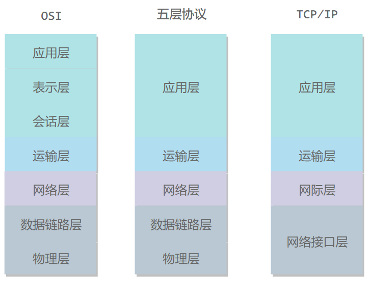
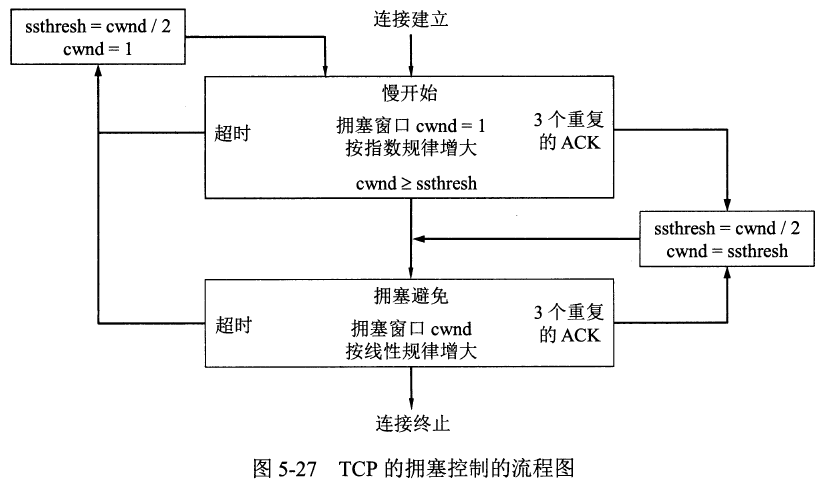
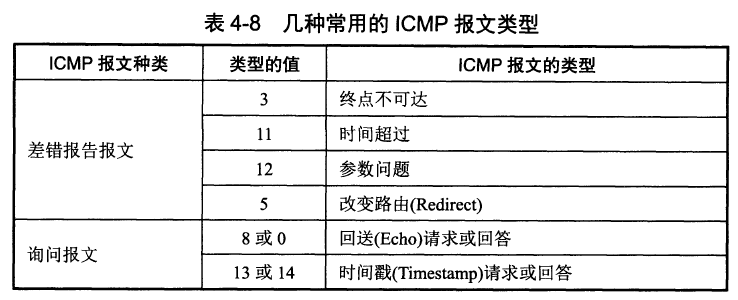

# 1 网络模型

## 1.1 OSI七层模型



**”物数网运会表应“**：

（7）应用层：为特定的程序提供数据传输服务，例如HTTP、DNS等协议。数据单位为报文；

（6）表示层：数据压缩、加密以及数据描述，这使得应用程序不用关心各台主机中数据内部格式不同的问题；

（5）会话层：建立及管理会话；

（4）运输层：为进程提供通用数据传输服务。由于应用层协议很多，定义通用的传输层协议就可以支持不断增多的应用层协议。运输层包括两种协议：**传输控制协议 TCP，提供面向连接、可靠的数据传输服务，数据单位为报文段**；**用户数据报协议 UDP，提供无连接、尽最大努力的数据传输服务，数据单位为用户数据报**。TCP 主要提供完整性服务，UDP 主要提供及时性服务。

（3）网络层：为主机提供数据传输服务。而传输层协议是为主机中的进程提供数据传输服务。网络层**把传输层传递下来的报文段或者用户数据报封装成分组**。

（2）数据链路层：网络层针对的还是主机之间的数据传输服务，而主机之间可以有很多链路，链路层协议就是为同一链路的主机提供数据传输服务（其最基本的服务是将源自物理层来的数据可靠地传输到相邻节点的目标机网络层）。数据链路层把网络层传下来的分组封装成帧。

（1）物理层：考虑的是怎样在传输媒体上传输数据**比特流**，而不是指具体的传输媒体。物理层的作用是尽可能**屏蔽传输媒体和通信手段的差异**，使数据链路层感觉不到这些差异。

## 1.2 TCP/IP模型

TCP/IP模型只有四层模型，它是将OSI七层模型的上面三层合并为**应用层**，底下两层合并为**网络接口层**。


## 1.3 数据在各层之间的传递过程

在向下的过程中，需要添加下层协议所需要的首部或者尾部；而在向上的过程中不断拆开首部和尾部。

路由器只有**下面三层协议**，因为路由器位于网络核心中，**不需要为进程或者应用程序提供服务**，因此也就不需要传输层和应用层。

# 2 应用层

主要作用：能够写出运行在不同端系统和通过网络彼此通信的程序，而不需要在网络核心设备上（路由器、链路层交换机）运行的软件。

## 2.1 应用程序体系结构

（1）C/S体系结构

（2）P2P体系结构

## 2.2 应用层本质

程序之间的通信本质上是**进程间的通信**，而网络通信实际上就是进程间跨越计算机网络**交换报文**。

套接字（Socket）：进程通过套接字从网络收发报文，所以套接字是进程与计算机网络之间的接口。从网络模型的角度上来说，套接字是应用层与运输层之间的接口。

## 2.3 Web[页面请求过程](https://www.cnblogs.com/kongxy/p/4615226.html)

（1）**DHCP 配置主机信息**

- 假设主机最开始没有 IP 地址以及其它信息，那么就需要先使用 DHCP 来获取。
- 主机生成一个 DHCP 请求报文，并将这个报文放入具有目的端口 67 和源端口 68 的 UDP 报文段中。
- 该报文段则被放入在一个具有广播 IP 目的地址(255.255.255.255) 和源 IP 地址（0.0.0.0）的 IP 数据报中。
- 该数据报则被放置在 MAC 帧中，该帧具有目的地址 FF:FF:FF:FF:FF:FF，将广播到与交换机连接的所有设备。
- 连接在交换机的 DHCP 服务器收到广播帧之后，不断地向上分解得到 IP 数据报、UDP 报文段、DHCP 请求报文，之后生成 DHCP ACK 报文，该报文包含以下信息：IP 地址、DNS 服务器的 IP 地址、默认网关路由器的 IP 地址和子网掩码。该报文被放入 UDP 报文段中，UDP 报文段有被放入 IP 数据报中，最后放入 MAC 帧中。
- 该帧的目的地址是请求主机的 MAC 地址，因为交换机具有自学习能力，之前主机发送了广播帧之后就记录了 MAC 地址到其转发接口的交换表项，因此现在交换机就可以直接知道应该向哪个接口发送该帧。
- 主机收到该帧后，不断分解得到 DHCP 报文。之后就配置它的 IP 地址、子网掩码和 DNS 服务器的 IP 地址，并在其 IP 转发表中安装默认网关。

（2）**ARP解析MAC地址**

- 主机通过浏览器生成一个 TCP 套接字，套接字向 HTTP 服务器发送 HTTP 请求。为了生成该套接字，主机需要知道网站的域名对应的 IP 地址。
- 主机生成一个 DNS 查询报文，该报文具有 53 号端口，因为 DNS 服务器的端口号是 53。
- 该 DNS 查询报文被放入目的地址为 DNS 服务器 IP 地址的 IP 数据报中。
- 该 IP 数据报被放入一个以太网帧中，该帧将发送到网关路由器。
- DHCP 过程只知道网关路由器的 IP 地址，为了获取网关路由器的 MAC 地址，需要使用 ARP 协议。
- 主机生成一个包含目的地址为网关路由器 IP 地址的 ARP 查询报文，将该 ARP 查询报文放入一个具有广播目的地址（FF:FF:FF:FF:FF:FF）的以太网帧中，并向交换机发送该以太网帧，交换机将该帧转发给所有的连接设备，包括网关路由器。
- 网关路由器接收到该帧后，不断向上分解得到 ARP 报文，发现其中的 IP 地址与其接口的 IP 地址匹配，因此就发送一个 ARP 回答报文，包含了它的 MAC 地址，发回给主机。

（3）**DNS解析域名**

- 知道了网关路由器的 MAC 地址之后，就可以继续 DNS 的解析过程了。
- 网关路由器接收到包含 DNS 查询报文的以太网帧后，抽取出 IP 数据报，并根据转发表决定该 IP 数据报应该转发的路由器。
- 因为路由器具有内部网关协议（RIP、OSPF）和外部网关协议（BGP）这两种路由选择协议，因此路由表中已经配置了网关路由器到达 DNS 服务器的路由表项。
- 到达 DNS 服务器之后，DNS 服务器抽取出 DNS 查询报文，并在 DNS 数据库中查找待解析的域名。
- 找到 DNS 记录之后，发送 DNS 回答报文，将该回答报文放入 UDP 报文段中，然后放入 IP 数据报中，通过路由器反向转发回网关路由器，并经过以太网交换机到达主机。

（4）**HTTP请求页面**（报文中每个字段都是ASCII码串）

- 有了 HTTP 服务器的 IP 地址之后，主机就能够生成 TCP 套接字，该套接字将用于向 Web 服务器发送 HTTP GET 报文。
- 在生成 TCP 套接字之前，必须先与 HTTP 服务器进行三次握手来建立连接。生成一个具有目的端口 80 的 TCP SYN 报文段，并向 HTTP 服务器发送该报文段。
- HTTP 服务器收到该报文段之后，生成 TCP SYN ACK 报文段，发回给主机。
- 连接建立之后，浏览器生成 HTTP GET 报文，并交付给 HTTP 服务器。
- HTTP 服务器从 TCP 套接字读取 HTTP GET 报文，生成一个 HTTP 响应报文，将 Web 页面内容放入报文主体中，发回给主机。
- 浏览器收到 HTTP 响应报文后，抽取出 Web 页面内容，之后进行渲染，显示 Web 页面。

## 2.4 常用端口

| 应用             | 应用层协议 | 端口号  | 传输层协议 | 备注                        |
| ---------------- | ---------- | ------- | ---------- | --------------------------- |
| 域名解析         | DNS        | 53      | UDP/TCP    | 长度超过 512 字节时使用 TCP |
| 动态主机配置协议 | DHCP       | 67/68   | UDP        |                             |
| 简单网络管理协议 | SNMP       | 161/162 | UDP        |                             |
| 文件传送协议     | FTP        | 20/21   | TCP        | 控制连接 21，数据连接 20    |
| 远程终端协议     | TELNET     | 23      | TCP        |                             |
| 超文本传送协议   | HTTP       | 80      | TCP        |                             |
| 简单邮件传送协议 | SMTP       | 25      | TCP        |                             |
| 邮件读取协议     | POP3       | 110     | TCP        |                             |
| 网际报文存取协议 | IMAP       | 143     | TCP        |                             |

## 2.5 HTTP长短连接的使用场景是什么？

长连接：多用于读写操作频繁，点对点的通讯，而且客户端数目较少的情况。例如即时通讯、网络游戏等。

短连接：用户数目比较多的Web网站一般采用短连接，防止服务器资源被被无效占用。

## 2.6 怎么知道HTTP的报文长度？

当响应消息中存在Content-length字段时，可以根据该字段来判断是否接收完成；

如果服务器事先不知道请求内容的大小时，例如动态加载过程，就需要使用Transfer-Encoding:chunked的方式来代替Contend-Length。

## 2.7 HTTP方法有哪些？

HTTP/1.0定义了三种方法：GET、POST、HEAD方法。

HTTP/1.1增加了六种请求方法：PUT、DELETE、CONNECT、OPTIONS、TRACE、PATCH

| 方法    | 描述                                                         |
| ------- | ------------------------------------------------------------ |
| GET     | 请求**指定的页面信息**，并返回具体内容，通常只用于**读取数据**。 |
| HEAD    | 类似于 GET 请求，只不过返回的响应中没有具体的内容，用于获取报头。 |
| POST    | 向指定资源**提交数据处理请求**（例如提交表单或者上传文件）。数据被包含在请求体中。POST 请求可能会导致新的资源的建立或已有资源的更改。 |
| PUT     | 替换指定的资源，没有的话就新增。                             |
| DELETE  | 请求服务器删除 URL 标识的资源数据。                          |
| CONNECT | 将服务器作为代理，让服务器代替用户进行访问。                 |
| OPTIONS | 向服务器发送该方法，会返回对指定资源所支持的 HTTP 请求方法。 |
| TRACE   | 回显服务器收到的请求数据，即服务器返回自己收到的数据，主要用于测试和诊断。 |
| PATCH   | 是对 PUT 方法的补充，用来对已知资源进行局部更新。            |

## 2.8 HTTP和HTTPS的工作流程

**HTTP**：HTTP是一个基于TCP/IP的超文本传输协议，传输的数据类型为HTML文件，图片文件、查询结果等。


**HTTPS**：HTTP+SSL/TLS，通过SSL证书来验证服务器的身份，并为浏览器和服务器之间的通信进行加密。

SSL：Secure Socket Layer，安全套接字层，为数据通信提供安全支持。


## 2.9 HTTP和HTTPS[区别](https://zhuanlan.zhihu.com/p/112010468)

- HTTP以明文方式发送内容，数据都是未加密的，安全性较差；HTTPS数据传输过程是加密的，安全性较好；
- HTTP和HTTPS使用的是不同的连接方式，用的端口也不一样，HTTP是80端口，HTTPS是443端口；
- HTTP页面响应比HTTPS快，主要因为 HTTP 使用 3 次握手建立连接，客户端和服务器需要握手 3 次，而 HTTPS 除了 TCP 的 3 次握手，还需要经历一个 SSL 协商过程。

## 2.10 状态码

| 分类 | 描述                                                         |
| ---- | ------------------------------------------------------------ |
| 1XX  | 指示信息：表示请求正在处理                                   |
| 2XX  | 成功：表示请求成功                                           |
| 3XX  | 重定向：要完成的请求需要进行附加操作                         |
| 4XX  | 客户端错误：请求有无法错误或者请求无法实现，服务器无法处理请求 |
| 5XX  | 服务器错误：服务器处理请求出现错误                           |

## 2.11 套接字类型

套接字：套接字是不同主机上的进程之间进行双向通信的端点的抽象，网络进程通信的一端就是一个套接字。

分类：

- **流套接字（SOCK_STREAM）**：流套接字基于 TCP 传输协议，主要用于提供面向连接、可靠的数据传输服务。由于 TCP 协议的特点，使用流套接字进行通信时能够保证数据无差错、无重复传送，并按顺序接收，通信双方不需要在程序中进行相应的处理。
- **数据报套接字（SOCK_DGRAM）**：和流套接字不同，数据报套接字基于 UDP 传输协议，对应于无连接的 UDP 服务应用。该服务并不能保证数据传输的可靠性，也无法保证对端能够顺序接收到数据。此外，通信两端不需建立长时间的连接关系，当 UDP 客户端发送一个数据给服务器后，其可以通过同一个套接字给另一个服务器发送数据。当用 UDP 套接字时，丢包等问题需要在程序中进行处理。
- **原始套接字（SOCK_RAW）**：由于流套接字和数据报套接字只能读取 TCP 和 UDP 协议的数据，当需要传送非传输层数据包（例如 Ping 命令时用的 ICMP 协议数据包）或者遇到操作系统无法处理的数据包时，此时就需要建立原始套接字来发送。

## 2.12 负载均衡

负载均衡，英文名为 Load Balance，其含义是指将负载（工作任务）进行平衡、分摊到多个操作单元上进行运行，例如 FTP 服务器、Web 服务器、企业核心服务器和其他主要任务服务器等，从而协同完成工作任务。负载均衡建立在现有的网络之上，它提供了一种透明且廉价有效的方法扩展服务器和网络设备的带宽、增加吞吐量、加强网络处理能力并提高网络的灵活性和可用性。

负载均衡是分布式系统架构设计中必须考虑的因素之一，例如天猫、京东等大型用户网站中为了处理海量用户发起的请求，其往往采用**分布式服务器**，并通过引入**反向代理**等方式将用户请求均匀分发到每个服务器上，而这一过程所实现的就是负载均衡。

## 2.13 HTTP1.0 和 HTTP1.1 有什么区别？

（1）1.1使用开始采用长连接来优化短连接造成的性能开销；

（2）采用管道（pipeline）网络传输，可以一次性传输多个请求

## 2.14 HTTP1.1 和 HTTP２ 有什么区别？

（1）压缩头，发送多个头部相同的HTTP请求时不用重复发送。通过创建一个索引表实现的，发送索引就行了。

（2）全面采用二进制格式，header 和 body 改名为帧

# 3 运输层

运输层提供了进程间的逻辑通信。运输层向高层用户屏蔽了下面网络的核心细节，使应用程序看起来像是在两个运输层实体之间有一条端到端的逻辑通信信道。

TCP和UDP的区别：

（1）传输控制协议（Transmission Control Protocol，TCP）：面向**连接**的，提供**可靠交付**，有流量控制，拥塞控制，提供**全双工通信**，面向**字节流**（把应用层传下来的报文看成字节流，把字节流组织成大小不等的数据块），每一条 TCP 连接只能是**点对点**的（一对一）。

（2）用户数据报协议（User Datagram Protocol，UDP）：**无连接**的，**尽最大努力交付**，没有拥塞控制，面向**报文**（对于应用程序传下来的报文不合并也不拆分，只是添加 UDP 首部），支持一对一、一对多、多对一和多对多的交互通信。

## 3.1 TCP三次握手

TCP首部固定20个字节的长度:


（1）源端口和目的端口（16位）：和IP首部的源IP地址和目的IP地址可以唯一确定一个TCP连接；

（２）序号（32位）：表示在这个报文段中第一个数据字节序号；

（3）确认序号（32位）：仅当ACK标志为1时有效，**确认号表示期望收到的下一个字节的序号**；

（4）偏移（4位）：头部长度；

（6）保留（6位），必须为0；

（7）6个标志位（各1位）：

- URG-紧急指针有效；
- ACK-确认序号有效；
- PSH-接收方应尽快将这个报文交给应用层；
- RST-连接重置；
- SYN-同步序号用来发起一个连接；
- FIN-终止一个连接。

（8）窗口字段（16位）：代表窗口的字节容量，标准大小为2^16-1=65535个字节；

（9）包校验和（16位）：机器基于数据内容计算一个数值，收信息机要与源机器数值结果完全一样，从而证明数据的有效性。检验和覆盖了整个的TCP报文段：这是一个强制性的字段，一定是由发送端计算和存储，并由接收端进行验证的。计算校验和时，要在报文段的前面加上12字节的伪首部。

### 3.1.1 过程

为了保证数据传输成功，TCP采用三次握手策略：


（1）客户端向服务器发送**连接请求报文段**，SYN=1，序号seq=x，此时客户端进入**SYN-SENT**（同步已发送）状态。

【**第一次的seq序列号x是随机产生的**，这样是为了**网络安全**。如果不是随机产生初始序列号，黑客将会以很容易的方式获取到你与其他主机之间的初始化序列号，并且伪造序列号进行攻击】

（2）服务器收到连接请求报文，如果同意建立连接，则向客户端发送**连接确认报文段**，SYN=1，ACK=1，确认序号为ack=x+1，自己的序号seq=y，服务器进入SYN-RCVD（**同步已收到**）状态

【**SYN 是为了告诉发送端，发送方到接收方的通道没问题**；**ACK 用来验证接收方到发送方的通道没问题**】

（3）客户端收到服务器的连接确认报文后，还要向服务器**发出确认**，ACK=1，确认号为ack=y+1，自己的序号为seq=x+1，然后客户端进入**ESTABLISHED**（已建立连接）状态。

【最后一次确认是为了**防止已经失效的连接请求报文段又传回到了服务端**，从而产生错误】

（TCP规定，SYN报文段（SYN= 1）不能携带数据，但是会**消耗一个序号**，而ACK报文段**可以携带数据，但不携带数据就不消耗序号**）

### 3.1.2 为什么要进行三次握手？

TCP进行三次握手的原因是让**通信双方确认自己和对方的发送和接收**是正常的，建立**可靠的通信信道**。

### 3.1.3 为什么要进行第三次握手？

防止**已经失效的连接请求报文**又突然传送到了服务器，从而产生错误。

如果只有两次握手，可能会出现以下情况：

- 客户端发送了第一个请求连接并且没有丢失，但由于网络原因在节点中滞留。
- 由于TCP的客户端迟迟没有收到确认报文，以为服务器没有收到，此时重新向服务器发送连接请求报文，此后客户端和服务器经过两次握手完成连接，传输数据，然后关闭连接。 
- 此时此前滞留的那一次请求连接，网络通畅了到达服务器，这个报文本该是失效的，但是，两次握手的机制将会让客户端和服务器再次建立连接，这将导致不必要的错误和资源的浪费。 
- 如果采用的是三次握手，就算是那一次失效的报文传送过来了，服务端接受到了那条失效报文并且回复了确认报文，但是客户端不会再次发出确认。由于服务器收不到确认，就知道客户端并没有请求连接。

### 3.1.4 最后一次握手丢失会发生什么？

- 如果最后一次ACK在网络中丢失，那么**服务端的TCP连接状态仍为SYN_RECV**，并且根据 TCP的**超时重传机制**依次等待3秒、6秒、12秒后重新发送 SYN+ACK 包，默认重复5次，以便 **客户端重新发送ACK包** 
- 如果重发指定次数后，**仍然未收到ACK应答**，那么一段时间后，**服务端自动关闭这个连接** 
- 但是客户端认为这个连接已经建立，如果客户端端向服务端发送数据，**服务端将以RST包（Reset，RST标示复位，用于异常的关闭连接）响应**，此时，**客户端知道第三次握手失败**

### 3.1.5 SYN洪泛攻击是什么？

SYN洪泛（SYN Flood）攻击，利用TCP协议缺陷，发送大量**伪造的TCP连接请求**，常用假冒的IP或IP号段发来海量的**请求连接的第一个握手包（SYN包）**，被攻击服务器回应第二个握手包（SYN+ACK包），因为对方是假冒IP，对方永远收不到包且不会回应第三个握手包。**导致被攻击服务器保持大量SYN_RECV状态的“半连接”**，并且会重试默认5次回应第二个握手包，**大量随机的恶意SYN占满了未完成连接队列，导致正常合法的SYN排不上队列，让正常的业务请求连接不进来**。

解决方法:

- 缩短超时重传时间（SYN Timeout）时间
- 增加最大半连接数
- **SYN Cache**：该方法首先构造一个全局 Hash Table，用来缓存系统当前所有的半开连接信息。在 Hash Table 中的每个桶的容量大小是有限制的，当桶满时，会主动丢掉早来的信息。当服务端收到一个 SYN 消息后，会通过一个映射函数生成一个相应的 Key 值，使得当前半连接信息存入相应的桶中。当收到客户端正确的确认报文后，服务端才开始分配传输资源块，并将相应的半开连接信息从表中删除。和服务器传输资源相比，维护表的开销要小得多。
- **SYN Cookies**：该方案原理和 HTTP Cookies 技术类似，服务端通过特定的算法将半开连接信息编码成序列号或者时间戳，用作服务端给客户端的消息编号，随 SYN-ACK 消息一同返回给连接发起方，这样在连接建立完成前服务端不保存任何信息，直到发送方发送 ACK 确认报文并且服务端成功验证编码信息后，服务端才开始分配传输资源。若请求方是攻击者，则不会向服务端会回ACK 消息，由于未成功建立连接，因此服务端并没有花费任何额外的开销。
- **SYN Proxy** [ˈprɒksi]：在客户端和服务器之间部署一个代理服务器，类似于防火墙的作用。通过代理服务器与客户端进行建立连接的过程，之后代理服务器充当客户端将成功建立连接的客户端信息发送给服务器。这种方法基本不消耗服务器的资源，但是建立连接的时间变长了（总共需要 6 次握手）。

### 3.1.6 TCP握手后，客户端掉线了服务器知道吗？

三次握手完成后，若客户端掉线了，由于**保活机制**在连接后会隔一段时间发送一个**保活探测报文**，超过保活探测次数的话服务器就会知道，然后就及时关闭连接。

如果短时间内客户端重新上线，若双方都没有释放连接的话，则不需要重新握手。

## 3.2 TCP四次挥手

### 3.2.1 过程


（1）A发送**连接释放报文段**FIN=1，seq=u，并停止再发送数据，主动关闭TCP的连接，此时A进入终止等待１（FIN－WAIT－１）状态，等待B的确认；

（2）B收到这个FIN，发回一 个ACK确认报文ACK=1，seq=v，ack=u+1，确认序号为收到的序号加1（和 SYN 一样，一个 FIN 将占用一个序号），此时B进入关闭等待（CLOSE-WAIT）状态。此时 TCP 属于半关闭状态，A没有数据要发送了，但是若B发送数据A任然要接收。A收到来自B的确认后，进入终止等待２（FIN－WAIT-2）状态，等待B发送连接释放报文段；

（3）当B不需要发送数据时，发送一个连接释放报文段FIN=1，ACK=1，seq=w，ack=u+1，此时B进入最后确认状态（LAST-ACK），等待A的确认；

（4）A收到B的连接释放报文段后，回复确认报文段ACK=1，ack=w+1，seq=u+1，B收到回复后进入CLOSED状态，撤销相应的PCB后撤销TCP连接。而A进入到TIME-WAIT（时间等待）状态，等待２MSL（Maximum Segment Lifetime，最长报文段寿命,1MSL = 2min）时间后进入CLOSED状态，撤销相应的传输控制块PCB后，结束本次TCP连接。

### 3.2.2 为什么挥手要四次，而不是三次？

建立连接的时候，服务器在LISTEN状态下收到客户端的SYN连接请求报文段后，是将SYN和ACK放在一个报文中发送给（第二次握手）客户端的。

关闭连接时，服务器收到对方的连接释放报文段后，只是代表客户端不会再发送数据了（仍然能接收数据），而服务器可以选择立即关闭，也可以选择继续发送数据，所以是将ACK和FIN分开发送，从而导致多了一次。

### 3.2.3 为什么要有一个FIN-WAIT-2状态？

A接收到B的确认后（第二次挥手后），就进入到了FIN-WAIT-2状态。如果这个时候因为网络突然断掉、服务器宕机等原因导致A无法收到B的FIN报文段，这个时候就需要FIN-WAIT-2定时器。定时器超时后A还未收到B的FIN的话，就直接进入CLOSE状态，减少资源占用。

### 3.2.3 为什么最后要等2MSL？

MSL：报文最大生存时间

（1）为了保证A发送的最后一个ACK能够到达B。如果处在LAST-ACK状态的B在没有收到A的ACK报文段的话，B会超时重传FIN报文段（重新第三次挥手），若A能在2MSL的时间内收到FIN报文段，A就会重传最后一次ACK报文段，并重启2MSL计时器，使得A和B都能成功进入CLOSEＤ状态。如果不等待的话，A直接进入CLOSEＤ，万一B没有收到确认，就无法进入CLOSEＤ状态

（２）防止“已经失效的连接请求报文段”出现在本连接中。A在发送完最后一个ACK报文段后，再经过２MSL，就可以使本连接持续的时间内所产生的所有报文段从网络中消失。这样就可以使下一个连接中不会出现旧的连接请求报文段。

默认是60s，可以修改：

```
cat /proc/sys/net/ipv4/tcp_fin_timeout
echo 120 > /proc/sys/net/ipv4/tcp_fin_timeout
```


### 3.2.4 TIME-WAIT状态的连接过多产生什么后果，怎么处理？

后果：

（1）对于服务器来说，短时间内关闭了大量的客户端连接，就会造成服务器上出现大量的TIME_WAIT连接，服务器每维护一个连接需要一个socket，也就是每一个连接会占用一个文件描述符，而文件描述符的使用是有上限的，如果持续高并发短连接，会导致一些正常的连接失败。

（2）对于客户端来说，短时间内大量的短连接，会大量**消耗端口**，毕竟端口只有65535个，端口被耗尽了，后续就无法在发起新的连接了 

解决方法：

（1）用**负载均衡**来抗这些高并发的短请求。

（2）服务器可以设置 SO_REUSEADDR 套接字选项来避免 TIME_WAIT状态，使服务器处于TIME_WAIT状态下的端口能够快速回收和重用。（允许TIME_WAIT状态下的套接字能够重新用于新的连接）

（3）强制关闭，发送 RST 包越过TIME-WAIT状态，直接进入CLOSED状态。

### 3.2.5 服务端会有TIME-WAIT状态吗？

一般来说，**主动撤销连接**的都会进入到TIME-WAIT状态。

### 3.2.6 有很多CLOSE_WAIT怎么解决？

- 检查是否是服务端程序忘记关闭连接；
- 调整参数，CLOSE_WAIT的维持时间是可调的，可以手动缩短等待时间。

## 3.3 TCP传输控制

### 3.3.1 TCP可靠传输原理

- 数据分块：应用数据被分割成 TCP 认为最适合发送的数据块。
- 序列号和确认应答：TCP 给发送的每一个包进行编号，在传输的过程中，每次接收方收到数据后，都会对传输方进行确认应答，即发送 ACK 报文，这个 ACK 报文当中带有对应的确认序列号，告诉发送方成功接收了哪些数据以及下一次的数据从哪里开始发。除此之外，接收方可以根据序列号对数据包进行排序，把有序数据传送给应用层，并丢弃重复的数据。
- 校验和： TCP 将保持它首部和数据部分的检验和。这是一个端到端的检验和，目的是检测数据在传输过程中的任何变化。如果收到报文段的检验和有差错，TCP 将丢弃这个报文段并且不确认收到此报文段。
- 流量控制： TCP 连接的双方都有一个固定大小的缓冲空间，发送方发送的数据量不能超过接收端缓冲区的大小。当接收方来不及处理发送方的数据，会提示发送方降低发送的速率，防止产生丢包。TCP 通过滑动窗口协议来支持流量控制机制。
- 拥塞控制： 当网络某个节点发生拥塞时，减少数据的发送。
- ARQ（自动重传请求）协议： 也是为了实现可靠传输的，它的基本原理就是每发完一个分组就停止发送，等待对方确认。在收到确认后再发下一个分组。**连续ARQ**采用**累积确认**方式：接收方在收到几个分组后，**对按序列到达的最后一个分组发送确认**。
- 超时重传： 当 TCP 发出一个报文段后，它启动一个定时器，等待目的端确认收到这个报文段。如果超过某个时间还没有收到确认，将重发这个报文段。

### 3.3.2 TCP流量控制

流量控制是为了**控制发送方发送速率**，保证接收方**来得及接收**。

接收方发送的确认报文中的窗口（滑动窗口）字段可以用来控制发送方窗口大小，从而影响发送方的发送速率。将窗口字段设置为 0，则发送方不能发送数据。

### 3.3.3 TCP拥塞控制

如果网络出现拥塞，分组将会丢失，此时发送方会继续重传，从而导致网络拥塞程度更高。因此当出现拥塞时，应当控制发送方的速率。这一点和流量控制很像，但是出发点不同。流量控制是为了让接收方能来得及接收，而拥塞控制是为了**降低整个网络的拥塞程度**。

（1）**慢开始**与**拥塞避免**

发送的最初执行慢开始，令 cwnd = 1，发送方只能发送 1 个报文段；当收到确认后，将 cwnd 加倍，因此之后发送方能够发送的报文段数量为：2、4、8 ...

注意到慢开始每个轮次都将 cwnd 加倍，这样会让 cwnd 增长速度非常快，从而使得发送方发送的速度增长速度过快，网络拥塞的可能性也就更高。设置一个慢开始门限 ssthresh，当 cwnd >= ssthresh 时，进入拥塞避免，每个轮次只将 cwnd 加 1。

如果出现了超时，则令 ssthresh = cwnd / 2，然后重新执行慢开始。



（2）**快重传**与**快恢复**

在接收方，要求每次接收到报文段都应该对**最后一个已收到的有序报文段进行确认**。例如已经接收到 M1 和 M2，此时收到 M4，应当发送对 M2 的确认。

在发送方，如果收到三个重复确认，那么可以知道下一个报文段丢失，此时执行快重传，立即重传下一个报文段。例如收到三个 M2，则 M3 丢失，立即重传 M3。

在这种情况下，只是丢失个别报文段，而不是网络拥塞。因此执行快恢复，令 ssthresh = cwnd / 2 ，cwnd = ssthresh，注意到此时直接进入拥塞避免。

**慢开始和快恢复的快慢指的是 cwnd 的设定值**，而不是 cwnd 的增长速率。慢开始 cwnd 设定为 1，而快恢复 cwnd 设定为 ssthresh。


### 3.3.4 TCP粘包

因为TCP采用的是流式传输数据，发送方发送的若干包数据到接收方接收时粘成一包，从接收缓冲区看，后一包数据的头紧接着前一包数据的尾，这种叫粘包。

发送方写入的数据大于套接字缓冲区的大小，此时将发生拆包。

[产生原因](https://zhuanlan.zhihu.com/p/124733940)：

**1.**由TCP连接复用造成的粘包问题。

如果没有复用一个连接只提供给端到端的两个进程使用，这是数据的传输方和发送方都是约定好了数据的格式的，但是**多个进程**使用一个TCP连接，此时**多种不同结构**的数据进到TCP的流式传输，边界分割肯定会出这样或者那样的问题。

如果利用tcp每次发送数据，就与对方建立连接，然后双方发送完一段数据后，就关闭连接，这样就不会出现粘包问题

**2.**因为TCP默认会使用Nagle [ˈneɪgəl]算法，此算法会导致粘包问题。

而Nagle算法主要做两件事，1）只有上一个分组得到确认，才会发送下一个分组；2）收集多个小分组，在一个确认到来时一起发送。

多个分组拼装为一个数据段发送出去，如果没有好的边界处理，在解包的时候会发生粘包问题。

**3.**数据包过大造成的粘包问题。

比如应用进程缓冲区的一条消息的字节的大小超过了发送缓冲区的大小，就有可能产生粘包问题。因为消息已经被分割了，有可能一部分已经被发送出去了，对方已经接受了，但是另外一部分可能刚放入套接口发送缓冲区里准备进一步发送，就直接导致接受的后一部分，直接导致了粘包问题的出现。

**4.**流量控制，拥塞控制也可能导致粘包。

**5.**接收方不及时接收缓冲区的包，造成多个包接收。

解决方法：

1. Nagle算法问题导致的，需要结合应用场景适当关闭该算法。
2. 其他几种情况的处理方法主要分两种：

- 尾部标记序列。通过特殊标识符表示数据包的边界，例如\n\r，\t，或者一些隐藏字符。
- 头部标记分步接收。在TCP报文的头部加上表示数据长度。
- 应用层发送数据时定长发送。

## 3.4 UDP协议

### 3.4.1 用户数据报

UDP协议对应用层交下来的报文，既不合并也不拆分，而是保留这些报文的边界，添加首部后，就直接传输。

用户数据报UDP有两个字段，数据字段和**首部**字段。首部字段只有8个字节长度：

（1）源端口：

（2）目的端口：

（3）长度：数据报的长度。最小长度为８。

（4）校验和：检测UDP用户数据报在传输中是否有错。

如果接收方UDP发现收到的报文中的目的端口号不正确，就丢弃该报文，并由**网际控制报文协议ICMP发送“端口不可达”差错报**给发送方。

### 3.4.2 UDP为什么是不可靠的？

UDP 只有一个 socket **接收缓冲区**，没有 socket 发送缓冲区，即只要有数据就发，不管对方是否可以正确接收。而在对方的 socket 接收缓冲区满了之后，新来的数据报无法进入到 socket 接受缓冲区，此数据报就会被丢弃，因此 UDP 不能保证数据能够到达目的地；此外，UDP 也没有流量控制和重传机制，故UDP的数据传输是不可靠的。

## 3.5 RTMP协议

RTMP（Real Time Messaging Protocol） 是由 Adobe 公司基于 Flash Player 播放器对应的音视频 flv 封装格式提出的一种，基于TCP 的数据传输协议。本身具有稳定、兼容性强、高穿透的特点。常被应用于流媒体直播、点播等场景。常用于推流方（主播）的稳定传输需求。

# 4 网络层

## 4.1 ARP 地址解析协议的原理和地址解析过程

ARP（Address Resolution Protocol）是地址解析协议的缩写，该协议提供**根据 IP 地址获取物理地址（MAC）**的功能，它工作在第二层，是一个**数据链路层协议**（可以说，在TCP/IP模型中，ARP协议属于网络层；在OSI模型中，ARP协议属于链路层。），其在本层和物理层进行联系，同时向上层提供服务。当通过以太网发送 IP 数据包时，需要先封装 32 位的 IP 地址和 48位 MAC 地址。在局域网中两台主机进行通信时需要依靠各自的物理地址进行标识，但由于发送方只知道目标 IP 地址，不知道其 MAC 地址，因此需要使用地址解析协议。

ARP 协议的**解析过程**如下：

1. 首先，每个主机都会在自己的 ARP 缓冲区中建立一个 ARP 列表，以表示 IP 地址和 MAC 地址之间的对应关系；

2. 当源主机要发送数据时，首先检查 ARP 列表中是否有 IP 地址对应的目的主机 MAC 地址，如果存在，则可以直接发送数据，否则就向同一子网的所有主机发送 ARP 数据包。该数据包包括的内容有源主机的 IP 地址和 MAC 地址，以及目的主机的 IP 地址。

3. 当本网络中的所有主机收到该 ARP 数据包时，首先检查数据包中的目的主机IP 地址是否是自己的 IP 地址，如果不是，则忽略该数据包，如果是，则首先从数据包中取出源主机的 IP 和 MAC 地址写入到自己的 ARP 列表中，如果已经存在，则覆盖，然后将自己的 MAC 地址写入 ARP 响应包中，告诉源主机自己是它想要找的 MAC 地址。

4. 源主机收到 ARP 响应包后。将目的主机的 IP 和 MAC 地址写入 ARP 列表，并利用此信息发送数据。如果源主机一直没有收到 ARP 响应数据包，表示 ARP 查询失败。

## 4.2 ICMP协议

ICMP（Internet Control Message Protocol）是因特网控制报文协议，主要是实现 IP 协议中未实现的部分功能，是一种网络层协议。该协议并不传输数据，只传输控制信息来辅助网络层通信。其主要的功能是验证网络是否畅通（确认接收方是否成功接收到 IP 数据包）以及辅助 IP 协议实现可靠传输（若发生 IP 丢包，ICMP 会通知发送方 IP 数据包被丢弃的原因，之后发送方会进行相应的处理）。



（1）终点不可达：当路由器或主机不能交付数据报时向源点发送终点不可达报文。

（2）时间超过：当路由器收到生存时间为零的数据报时，除丢弃该数据报外，还要向源点发送时间超过报文。当终点在预定时间内不能收到一个数据报的全部数据报片时，就把已收到的数据报片全丢弃，并向源点发送时间超过报文。

（3）参数问题：当路由器或目的主机收到的**数据报的首部**中有字段值不正确时，丢弃该数据报，并向源点发送参数问题报文。

（4）改变路由：路由器把改变路由报文发送给主机，让主机知道下次应将数据报发送给另外的路由器。

（5）回送请求或回答：用来测试目的站是否可达以及了解其有关状态。

（6）时间戳请求或回答：请某台主机或路由器回答当前的日期和时间。可用于时钟同步和时间测量

Ping（Packet Internet Groper），即因特网包探测器，是一种工作在网络层的服务命令，主要用于测试网络连接量。本地主机通过向目的主机发送 **ICMP Echo 请求报文**，目的主机收到之后会发送 Echo 响应报文，Ping 会根据时间和成功响应的次数估算出数据包往返时间以及丢包率从而推断网络是否通常、运行是否正常等。

## 4.3 IGMP协议（多播中使用）

IGMP（Internet Group Management Protocol）网际组管理协议，是让连接在本地局域网上的多播路由器知道本局域网上是否有主机（严格讲是主机上的某个进程）参加或退出了某个多播组。

# 6 物理层

本层上进行比特率的传输，详细地说就是模拟信号和数字信号的传输。

ARP协议（数据链路层）：

（1）MAC 地址和 IP 地址分别有什么作用？

- MAC 地址是数据链路层和物理层使用的地址，是写在网卡上的物理地址。MAC 地址用来**定义网络设备的位置**。
- IP 地址是网络层和以上各层使用的地址，是一种逻辑地址。IP 地址用来区别网络上的计算机。

（2）为什么有了 IP 地址还需要 MAC 地址？

只有当设备连入网络时，才能根据他进入了哪个子网来为其分配 IP 地址，在设备还没有 IP 地址的时候或者在分配 IP 地址的过程中，我们需要 MAC 地址来区分不同的设备。

（3）为什么有了 MAC 地址还需要 IP 地址？

如果我们只使用 MAC 地址进行寻址的话，我们需要路由器记住每个 MAC 地址属于哪一个子网，不然每一次路由器收到数据包时都要满世界寻找目的 MAC 地址。而我们知道 MAC 地址的长度为 48 位，也就是说最多总共有 2 的 48 次方个 MAC 地址，这就意味着每个路由器需要 256 T 的内存，这显然是不现实的。

和 MAC 地址不同，IP 地址是和地域相关的，在一个子网中的设备，我们给其分配的 IP 地址前缀都是一样的，这样路由器就能根据 **IP 地址的前缀**知道这个设备属于哪个子网，剩下的寻址就交给子网内部实现，从而大大减少了路由器所需要的内存。

# 8 面经总结

## 8.1 [HTTP和HTTPS](https://zhuanlan.zhihu.com/p/72616216)的区别

（1）HTTPS是HTTP协议的安全版本，HTTP协议的数据传输是明文的，是不安全的，HTTPS使用了SSL/TLS协议进行了加密处理。

（2）http和https使用连接方式不同，默认端口也不一样，http是80，https是443。

## 8.2 [get和post](https://zhuanlan.zhihu.com/p/57361216)的区别

本质上没有区别，都是TCP连接，

（1）get多用于查询，会将请求参数放在URL中，用？或者&隔开，用户可以直接看到内容；而post一般用于提交数据，信息一般放在HTTP包体里面，用户无法看见内容；

（2）get提交的数据长度是有限制的，因为URL的长度有限制（浏览器限制。IE是2048字节，chrome是8182字节），而post没有长度限制；

（3）get是幂等的，post不是。

## 8.3 一些端口及对应的服务


## 8.4 浏览器输入网址后发生了什么？

（1）查找域名对应的IP地址。这一步会依次查找浏览器缓存、系统缓存、路由器缓存、ISPNDS缓存和根域名服务器；

（2）浏览器向IP地址发送一个HTTP请求；

（3）服务器响应请求，发回网页内容；

（4）浏览器解析网页内容

## 8.5 ARP协议的工作过程


## 8.6 什么是套接字？

《Linux网络编程》：进程间通信端口的抽象。

## 8.7 文件描述符

Unix系统中，一切皆文件。

文件描述符是指向文件的引用的抽象化概念。文件描述符是一个非负整数，实际上它是一个索引值，指向内核为进程所维护的**记录表**，记录表中记录着进程打开的所有文件。 

## 8.8 socket本地通信需要通过tcp/ip协议栈吗

本地socket通信用的是unix domain，跟网络socket不一样，unix domain应该是Socket fd绑定到一个本地cfile文件，然后通过对cfile文件的读写实现进程间通信

## 8.9 select和epoll的区别

相同点：无论是select还是epoll都是让内核去监听是否有相应事件发生的，然后用户再去执行操作；

不同点：select将文件描述符分成不同种类（可读，可写，异常），以“集合”的形式（fd_set）传给内核让其监听，当有事件发生时，内核会发出通知（select返回值），但是并不知道具体是谁，所以还需要进行一次判断；而epoll的监听是通过创建一颗红黑树（epoll_creat()），然后将所有的套接字放到树上（epoll_ctl()），设置好相应的监听事件后，每当事件发生时，内部通过与硬件的回调方法直接返回具体发生事件的套接字给用户，然后再进行相应操作，或者用户可以直接设置回调函数，在事件发生时直接执行。
